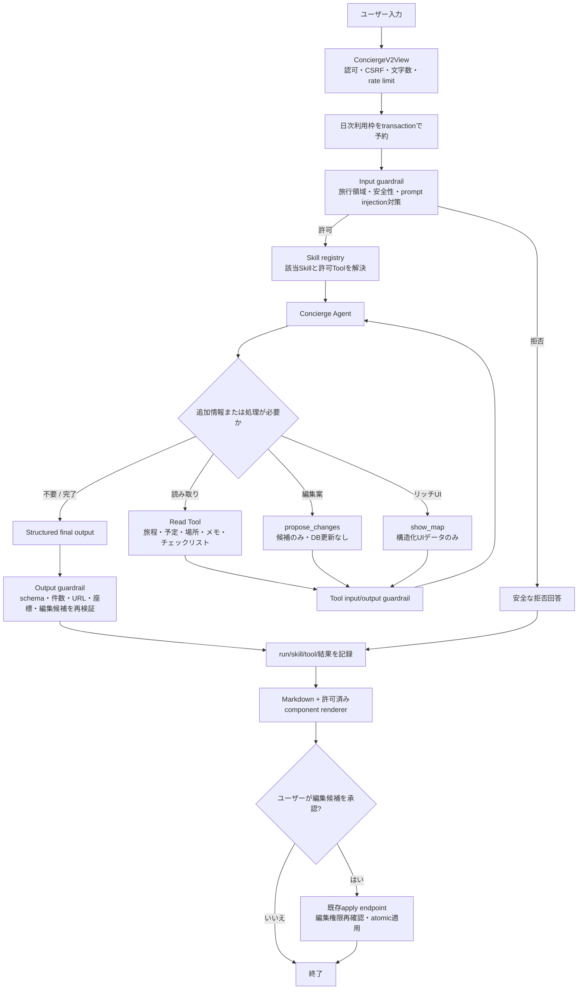
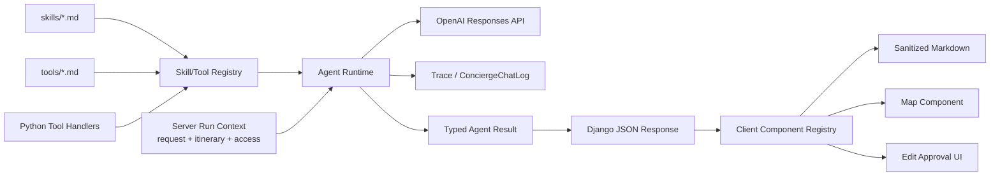
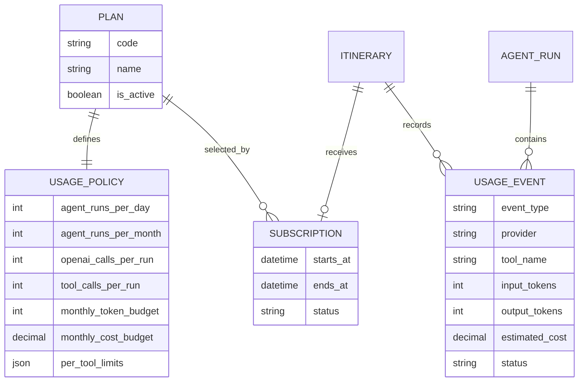

# Task 001: AIコンシェルジュをSkill・Tool駆動のAIエージェントへ更新する

- 種別: アーキテクチャ刷新 / AI / UI / セキュリティ
- 優先度: High
- 対象: 現行V2 AIコンシェルジュ
- 対象外: V1画面、ユーザーアカウント機能、確認なしの自動編集

## 目的

現在の「安全判定 → 必要データ選択 → 回答生成」という固定3段階処理を、ユーザーの依頼に応じてSkillを選択し、必要なToolだけを反復実行できるAIエージェントへ更新する。

以下を同時に満たすこと。

- SkillとToolを追加・変更しやすいファイル構成にする。
- SkillとToolは、1件につき1つのMarkdownファイルで管理する。
- 旅程、行きたい場所、メモ、チェックリストなどを必要なときだけ取得する。
- 地図などのリッチUIを安全に会話内へ表示する。
- しおりの更新は、従来どおり「候補提示」と「ユーザー確認後の適用」を分離する。
- 認可、入力上限、件数上限、日次利用上限、非DEBUG時のエラー秘匿を維持する。
- Tool実行、Skill選択、安全判定、最終回答を追跡・評価できるようにする。
- AIモデルや外部APIの呼び出し回数・使用量を制限し、将来は料金プランごとに上限を変更できるようにする。

## 現状

現行実装は主に次のファイルにある。

- `project_tabisync/tabisync/openai_concierge.py`
  - OpenAI Responses APIを`urllib`で直接呼び出す。
  - `run_moderation`、`run_data_selection`、`run_answer`の固定3段階で処理する。
  - 回答と`edit_actions`をStructured Outputsで生成する。
- `project_tabisync/tabisync/views/concierge.py`
  - 閲覧認可、日次上限の予約、コンテキスト組み立て、ログ保存を行う。
  - `concierge_v2_apply_changes`がユーザー確認後に編集候補を適用する。
- `project_tabisync/templates/tabisync/content/concierge_v2.html`
  - 簡易Markdownをブラウザ側でHTMLへ変換する。
  - 会話履歴と未適用の編集候補を`localStorage`へ保存する。
- `ConciergeChatLog`
  - 固定3段階のprompt/result/contextを保存するが、複数Tool呼び出しの記録形式ではない。

現状のデータ選択は1回限りであり、回答生成中に追加データが必要になっても再取得できない。Skill、Tool、UI部品の独立した登録機構もない。

## 採用方針

### エージェントランタイム

目標構成はOpenAI Agents SDKを用いた単一のオーケストレーターエージェントとする。Agents SDKは、反復Tool loop、ガードレール、セッション、トレースを扱う用途に適している。

ただし、実装開始前に現在のPython 3.8、Django、同期View、Gunicorn構成との互換性を確認すること。Agents SDKの採用に必要なPython更新が本タスクの許容範囲を超える場合は、次のどちらかを明示的に決定し、ADRまたは本書の実装記録へ残す。

1. Pythonランタイムを対応バージョンへ更新し、Agents SDKを採用する。
2. Responses APIのfunction calling loopをアプリケーション側で実装し、同じSkill/Tool契約を維持する。

独自loopを選ぶ場合も、モデル出力の`function_call`を実行し、対応する`function_call_output`を返し、最終回答または上限到達まで繰り返す標準フローにする。現在の固定3回呼び出しを名前だけ変更して残す構成にはしない。

### 単一エージェントを初期構成とする理由

初期リリースでは、オーケストレーター1体がSkillを選びToolを使う構成とする。旅行案内、旅程参照、編集候補作成は同一のしおりコンテキストと確認フローを共有するため、最初から複数エージェントへ分割する必然性が低い。

Skillごとの指示やTool数が大幅に増え、誤ルーティングが評価で確認された場合に限り、Skillを専門エージェントへ昇格し、agent-as-toolまたはhandoffを導入する。

### SkillとToolの定義

- Skillは「どの依頼に使うか」「どのToolを使えるか」「守る制約」「期待する回答」を記述するMarkdownである。
- Toolは「いつ使うか」「入力・出力」「副作用」「認可」「エラー」を記述するMarkdownと、対応するPython実装である。
- Markdownを唯一の実行コードにはしない。ToolのJSON SchemaとPython handlerは起動時にregistryで対応付け、定義不整合をテストで検出する。
- Markdown内の自由記述をそのまま強い権限として扱わない。利用可能Tool、認可、引数検証、副作用の可否はPython側の許可リストを正とする。

## 目標ディレクトリ構成

```text
project_tabisync/tabisync/concierge_agent/
├── __init__.py
├── agent.py                  # Agent定義、run開始、最終結果の整形
├── registry.py               # Skill/Toolの検出、検証、許可リスト
├── schemas.py                # 最終回答、UI component、編集候補の型
├── guardrails.py             # 入力・出力・Tool実行前後の安全確認
├── context.py                # itinerary/request/access情報。モデルへ秘密値を渡さない
├── errors.py                 # 内部例外と公開エラーの分離
├── tracing.py                # run/skill/tool/latency/token/errorの記録
├── usage.py                  # 利用枠の予約、確定、解放、上限判定
├── skills/
│   ├── itinerary_guide.md
│   ├── trip_planner.md
│   ├── place_guide.md
│   ├── packing_guide.md
│   └── note_assistant.md
└── tools/
    ├── get_itinerary.md
    ├── get_schedules.md
    ├── get_want_to_go.md
    ├── get_memo.md
    ├── get_checklist.md
    ├── propose_changes.md
    └── show_map.md

project_tabisync/tabisync/concierge_tools/
├── __init__.py
├── read_tools.py             # 読み取りTool実装
├── proposal_tools.py         # DBへ保存せず編集候補だけを生成
└── ui_tools.py               # 許可済みUI componentデータを生成
```

ファイル名は実装時に調整してよいが、「1 Skill = 1 Markdown」「1 Tool = 1 Markdown」と、定義・実装・registryの分離は維持する。

## Markdown定義フォーマット

### Skillファイル

各SkillはYAML front matterとMarkdown本文を持つ。

```markdown
---
id: place_guide
version: 1
title: 場所案内
description: 行きたい場所や予定場所を比較し、位置関係や移動判断を支援する
allowed_tools:
  - get_itinerary
  - get_schedules
  - get_want_to_go
  - show_map
max_tool_calls: 6
---

## Use when

- 場所の確認、比較、位置関係、移動順について聞かれたとき

## Do not use when

- 持ち物だけを相談されたとき

## Instructions

- しおり内の事実はToolで取得する。
- 取得できない営業時間や最新交通情報を推測しない。
- 地図が判断に役立つ場合だけ`show_map`を使う。

## Output contract

- 日本語で簡潔に回答する。
- UI表示は構造化`ui_components`で返す。
```

必須front matterは`id`、`version`、`description`、`allowed_tools`、`max_tool_calls`とする。未知のTool、重複ID、上限超過、必須項目欠落はDjango system checkまたはテストで失敗させる。

### Toolファイル

````markdown
---
id: get_schedules
version: 1
handler: concierge_tools.read_tools.get_schedules
side_effect: none
requires_access: view
timeout_seconds: 2
---

## Description

指定された旅行日の予定を、現在のしおりから取得する。

## Input schema

```json
{
  "type": "object",
  "additionalProperties": false,
  "properties": {
    "days": {
      "type": "array",
      "items": {"type": "integer", "minimum": 1},
      "maxItems": 14
    }
  },
  "required": ["days"]
}
```

## Output schema

Tool結果に必要なフィールドと最大件数を記述する。

## Errors

- `invalid_day`: 旅行期間外の日が指定された。
- `not_authorized`: 閲覧権限を確認できない。
````

全function toolはstrictなJSON Schemaを使い、`additionalProperties: false`と必須項目を定義する。Toolの説明には「いつ使うか」だけでなく「いつ使わないか」も短く記述する。

## 初期Skill一覧

| Skill | 役割 | 主なTool |
| --- | --- | --- |
| `itinerary_guide` | 既存旅程の質問、空き時間、日別要約 | `get_itinerary`, `get_schedules` |
| `trip_planner` | 日程案作成と編集候補提示 | 読み取りTool群, `propose_changes`, 必要時`show_map` |
| `place_guide` | 行きたい場所、位置関係、回り方 | `get_want_to_go`, `get_schedules`, `show_map` |
| `packing_guide` | 持ち物の確認と追加候補 | `get_itinerary`, `get_checklist`, `propose_changes` |
| `note_assistant` | メモの参照、整理、追記候補 | `get_memo`, `propose_changes` |

1回の依頼で複数Skillが必要な場合を許可する。ただし、選択Skillの和集合を無条件に全Tool公開せず、最大Tool数と利用条件をregistryで制限する。Skill選択結果はログへ残す。

## 初期Tool一覧

### 読み取りTool

- `get_itinerary`: タイトル、説明、旅行期間など最小限の基本情報を返す。
- `get_schedules`: 指定日の予定を返す。既存IDは更新候補作成に必要な場合だけ含める。
- `get_want_to_go`: 行きたい場所、住所、緯度経度、Google Place ID、予定日などを返す。
- `get_memo`: 正規化・タグ除去したメモを上限付きで返す。
- `get_checklist`: 正規化したチェックリストを上限付きで返す。

各Toolは`Itinerary`をモデル引数から受け取らず、サーバー側のrun contextから取得する。`pk`、token、セッションキー、パスワード、API keyをTool引数やモデルコンテキストに含めない。

### 編集候補Tool

- `propose_changes`: 既存の8種類の`edit_actions`を検証し、DBへ保存せず候補として返す。
- モデルからDB更新handlerを直接呼べるToolは公開しない。
- 最終応答に含まれた候補だけを、既存の`concierge_v2_apply_changes`でユーザー確認後に適用する。
- 適用時は閲覧権限と編集権限を再確認し、トランザクション、行ロック、件数上限、文字数上限、旅行日範囲を再検証する。

### UI Tool

- `show_map`: 地図表示用の構造化データを返す。HTML文字列は返さない。
- 初期版は、しおりに保存済みの場所のみを対象にする。
- 外部の最新情報や新規地点検索を追加する場合は、別Toolとして権限、費用、timeout、出典表示、障害時動作を定義する。

## 最終回答の契約

モデルの最終結果はStructured Outputsで次の論理構造に固定する。実際のJSON Schemaでは全プロパティ、必須項目、文字数・件数上限を明示する。

```json
{
  "reply_markdown": "回答本文",
  "ui_components": [
    {
      "type": "map",
      "title": "2日目の訪問候補",
      "places": [
        {
          "name": "場所名",
          "address": "住所",
          "latitude": 35.0,
          "longitude": 139.0,
          "google_place_id": "optional"
        }
      ]
    }
  ],
  "edit_actions": []
}
```

- `reply_markdown`は許可したMarkdownだけを描画する。
- `ui_components[].type`はサーバー側のenumとする。初期値は`map`のみ。
- component数、場所数、文字数、座標範囲をサーバー側で再検証する。
- 未知のcomponentは破棄して本文だけを表示する。
- `edit_actions`は既存の正規化処理と適用処理を再利用し、最大12件を維持する。

## HTML埋め込みと地図表示

モデルが生成したHTML、`iframe src`、JavaScript、CSSを`innerHTML`へ直接渡してはならない。モデルは構造化`ui_components`だけを返し、ブラウザ側がcomponent typeごとの固定DOMを生成する。

地図componentの実装要件:

1. Django側で場所が現在のItineraryに属することを確認する。
2. 緯度経度、住所、Place IDを検証・正規化する。
3. Google Maps URLまたはEmbed URLは、モデルの文字列を採用せずアプリ側で組み立てる。
4. Google Maps Embed APIを使う場合はAPI keyをHTMLやログへ不要に露出しない設計を検討し、keyのHTTP referrer制限を設定する。
5. `iframe`を使う場合は固定の許可ドメイン、`title`、`loading="lazy"`、`referrerpolicy`、必要最小限の`allow`/`sandbox`を指定する。
6. CSPの`frame-src`を導入または更新し、Google Mapsの必要なoriginだけを許可する。既存の外部スクリプト・画像との整合も確認する。
7. 埋め込みが失敗した場合は「Google Mapsで開く」リンクへフォールバックする。
8. モバイルでは高さを抑え、キーボード操作、スクリーンリーダー向けラベル、読み込み中表示を確認する。
9. 会話履歴には信頼済みHTMLを保存せず、元の`ui_components`データを保存して再描画する。

将来、地図以外のHTML相当UIを追加するときも、`type`ごとの許可リスト済みrendererを追加する。汎用`html` componentは作らない。

## 処理フロー



### コンポーネント構造



## ガードレールとセキュリティ

### 入力

- 現在の`CONCIERGE_USER_MESSAGE_MAX_LENGTH`と履歴上限を維持する。
- 旅行相談として許可できるかの判定をinput guardrailへ移す。
- Skill/Tool Markdown、Tool出力、しおり内テキストは命令ではなくデータとして区切る。
- 「以前の指示を無視」「tokenを表示」などの入力で秘密値や内部promptを返さないことをテストする。

### Tool

- Toolごとに`view`または`edit`権限を宣言し、handler実行前にコードで強制する。
- 読み取りToolでも対象Itineraryの境界を越えるIDを受け付けない。
- timeout、最大呼び出し回数、最大結果件数、run全体のdeadlineを設ける。
- 同一引数の読み取りToolは1 run内でキャッシュ可能にする。
- Toolエラーはモデル向けの短い型付きエラーと内部ログを分離する。

### 出力

- アプリケーションで利用する値は必ずStructured Outputsまたはstrict function schemaを使う。
- Markdown sanitizerまたは安全なDOM生成を採用し、独自正規表現rendererの安全性を見直す。
- `innerHTML`を使う箇所は、固定テンプレートまたは十分に検証済みのsanitizer出力だけに限定する。
- 非DEBUG環境でOpenAIのレスポンス本文、API key、内部prompt、stack traceを返さない。

### 編集

- AIが直接DB更新を完了したと表現しない。承認前は常に「変更候補」とする。
- 適用endpointはagent runと独立して再認可・再検証する。
- 変更候補の改ざん対策として、サーバー保存のproposal IDまたは署名付き短命payloadを検討する。採用しない場合は、現状どおり全項目を適用時に厳格に再検証する。

## 状態管理

- ブラウザ送信の全文履歴だけに依存する現状を見直す。
- `conversation_id`とItineraryを必ず結び付け、別しおりの履歴を混入させない。
- Agents SDK session、Responses APIの`previous_response_id`/conversation state、Django DB管理のいずれを採用するかを互換性・保持期間・個人情報方針とともに決定する。
- サーバー側stateを採用する場合も、OpenAI側stateだけを正本にせず、監査と復旧に必要な最小情報を自サービスへ保持する。
- 会話、Tool結果、位置情報の保持期間と削除方針は現状未定のため、本番化前に決定する。

## API・Tool利用上限と将来の料金プラン

現在の`Itinerary.concierge_daily_limit`は、ユーザーが開始したコンシェルジュ利用回数だけを制限している。Agent化後は1回のrun内でOpenAI APIや複数のToolを繰り返し呼ぶため、入口の回数制限だけでは費用、外部API quota、無限loopを十分に制御できない。

次の単位を独立して計測・制限できるようにする。

- Agent run回数（日次・月次）
- OpenAI API呼び出し回数（run単位・日次・月次）
- run全体のTool呼び出し回数
- Toolごとの呼び出し回数
- Web検索、地図、その他の課金対象外部APIごとの呼び出し回数
- OpenAIの入力token、出力token、合計token
- プロバイダーごとの推定利用金額
- runの最大経過時間と同時実行数

### プランと利用上限の分離

アプリケーションコードへ`free`、`paid`などの条件分岐を直接埋め込まず、料金プランと利用上限ポリシーを分離する。



モデル名やフィールド名は実装時に調整してよいが、最低限次の責務を分離する。

- `Plan`: 無料版、有料版などのプラン識別子と表示情報。
- `UsagePolicy`: プランごとの上限値。Tool別制限を含む。
- `Subscription`または`ItineraryEntitlement`: どの契約主体へどのポリシーを適用するか。
- `AgentRun`: 1回のユーザー依頼に対するAgent実行状態。
- `UsageEvent`: OpenAI API、Tool、外部API、token、推定費用の利用記録。
- `UsageLimitService`: 利用枠の確認、予約、確定、解放を一元管理する。

ユーザーアカウント機能がない初期段階では、`Itinerary`単位にデフォルトの無料ポリシーを適用する。将来アカウントや決済を追加した際に、契約主体をユーザー、組織、またはItineraryへ切り替えられるよう、上限判定を`Itinerary.concierge_daily_limit`の直接参照へ固定しない。

### 上限値の例

以下は構造を示す例であり、実際の値は費用計測後に決定する。

| 制限項目 | 無料ポリシー例 | 有料ポリシー例 |
| --- | ---: | ---: |
| Agent run | 5回/日 | 50回/日 |
| OpenAI API | 8回/run | 20回/run |
| 全Tool合計 | 6回/run | 15回/run |
| Web検索 | 2回/日 | 100回/月 |
| 月間token | 100,000 | 2,000,000 |

制限値を環境変数だけで管理しない。安全側のデフォルト値は設定に持てるが、プラン別の運用値はDBまたは設定registryから変更できるようにする。管理画面から変更可能にする場合も、負数、無制限値、極端な値を検証し、変更履歴を残す。

### 利用枠の予約と確定

並行リクエストによる上限超過を防ぐため、現在の日次利用枠予約と同等以上の原子性を維持する。

1. Agent run開始前に、日次・月次run上限と同時実行数を確認して利用枠を予約する。
2. OpenAI APIまたは課金対象Toolの実行直前に、run単位と課金期間単位の利用枠を予約する。
3. 呼び出し完了後に、成否、token、推定費用を確定する。
4. timeoutや接続失敗時に利用枠を消費するか解放するかを、provider/Toolごとのポリシーとして明示する。
5. 予約のまま残ったrunを検出し、期限切れとして回収できるようにする。

上限確認と利用記録を「件数を数えてからinsertする」だけの処理にしない。DBトランザクション、対象行のロック、条件付きupdate、または一意制約を使い、並行実行でも上限を超えないことを保証する。外部API呼び出し中は長時間DBロックを保持しない。

### Agent loopへの強制適用

- `max_tool_calls`はSkill Markdownの希望値とUsagePolicyの許容値の小さい方を採用する。
- OpenAI API呼び出し前とTool handler実行前に、共通の`UsageLimitService`を必ず通す。
- Agentのpromptだけに「最大N回」と書いて制限を委ねない。
- 上限到達時はloopを停止し、取得済み情報で回答可能なら限定的な回答を返す。回答不能ならユーザー向けの安全な上限到達メッセージを返す。
- 上限到達は内部エラーと区別し、`limit_type`、次回利用可能時刻、残量を公開可能な範囲で返す。
- クライアント表示の残量は参考情報とし、強制判定は常にサーバー側で行う。

### 使用量と費用

`UsageEvent`には少なくとも次を記録する。

- run ID、conversation ID、Itinerary ID
- event type（`agent_run`、`openai_call`、`tool_call`、`external_api_call`）
- provider、モデル、Tool名とversion
- 予約、成功、失敗、timeout、キャンセルのstatus
- 入力token、出力token、合計token
- 呼び出し回数と所要時間
- 通貨と推定費用、計算に使った価格表version

推定費用は請求額と一致する保証がないため、利用停止判定に使う場合は安全マージンを設ける。価格をコード内へ散在させず、version付きの価格設定へ集約する。価格不明時にも回数・token上限で必ず停止できるようにする。

API key、UUID token、パスワード、セッション値、prompt全文、Tool結果全文をUsageEventへ保存しない。管理画面や利用状況APIも対象Itineraryまたは契約主体の認可を必須とする。

### 既存データからの移行

- `Itinerary.concierge_daily_limit`は移行期間中の互換値として読み取れるようにする。
- デフォルト無料ポリシー作成後、既存Itineraryへ同等のrun上限を適用するdata migrationまたはfallback規則を用意する。
- 新しい制限経路の有効化後も、旧経路との二重カウントが起きないことを確認する。
- 移行完了前に既存フィールドを削除しない。削除は別タスクとmigrationで行う。

## ログ・トレース・評価

`ConciergeChatLog`を固定カラムの追加だけで拡張し続けず、run単位とevent単位を表現できる構造を追加する。

記録候補:

- run ID、conversation ID、turn index、Itinerary ID
- 選択Skill ID/version
- Tool名/version、引数の安全な要約、成否、所要時間、エラー種別
- モデル、response ID、入力/出力token、総所要時間
- guardrail判定、最終status、UI component type、編集候補数、適用結果

API key、閲覧/編集パスワード、UUID token、セッション値、不要な住所全文をログへ保存しない。既存ログのprompt/payload全文保存も、個人情報・コスト・保持期間の観点から見直す。

最低限のeval datasetを用意する。

- Day指定の予定照会
- 空き時間の抽出
- 行きたい場所を地図表示
- 持ち物提案と追加候補
- メモ参照と追記候補
- 複数データをまたぐ相談
- 不明情報への非推測回答
- prompt injection、越権参照、危険依頼
- Tool timeout、Tool結果0件、OpenAI障害
- 編集未承認、承認、改ざん、上限超過

評価指標は、回答正確性、Tool選択精度、不要Tool呼び出し数、編集候補妥当性、安全拒否、latency、token/リクエスト費用とする。

## 実装ステップ

### Phase 0: 技術検証と意思決定

1. Agents SDKとPython/Django/Gunicorn構成の互換性を検証する。
2. 同期Viewのまま実装するか、async化またはバックグラウンド実行するか決定する。
3. 1 runの最大時間、Tool回数、OpenAI呼び出し回数、費用上限を決める。
4. session/state方式と保持期間を決める。
5. Google Mapsの表示方式、API key制限、CSPを決める。

### Phase 1: 定義とregistry

1. `concierge_agent/`を追加する。
2. Skill/Tool Markdown loader、schema validator、registryを実装する。
3. 初期Skill/ToolのMarkdownを1件1ファイルで追加する。
4. Django system checkとunit testで定義不整合を検出する。
5. デフォルトUsagePolicyと、上限判定に必要なmodel/serviceを追加する。

### Phase 2: 読み取りAgent

1. 現在の`_build_selected_context`を読み取りToolへ分解する。
2. input guardrailと単一AgentのTool loopを実装する。
3. 最終回答をtyped schemaへ変更する。
4. 既存の日次予約・失敗時解放を新runの境界へ適合させる。
5. 旧固定3段階処理はfeature flag下で切替可能にし、回帰確認後に削除する。
6. OpenAI API呼び出しとTool実行を`UsageLimitService`経由にし、run/API/Tool上限を強制する。

### Phase 3: 編集候補

1. `propose_changes`を実装する。
2. 既存`edit_actions`正規化を共通serviceへ移す。
3. apply endpointと確認UIを維持し、新しいtyped resultへ接続する。
4. 未承認でDBが変化しないことを保証する。

### Phase 4: リッチUI

1. `ui_components` schemaとサーバー側validatorを追加する。
2. client component registryとmap rendererを追加する。
3. 履歴にはHTMLでなく構造化componentを保存する。
4. CSP、フォールバックリンク、モバイル、アクセシビリティを確認する。

### Phase 5: 可観測性、eval、段階リリース

1. run/eventログまたはAgents SDK traceを導入し、秘密値をredactする。
2. token、推定費用、provider別利用量を集計できるようにする。
3. unit/integration/evalテストを追加する。
4. feature flagで内部または一部しおりから有効化する。
5. latency、失敗率、Tool誤選択、費用、ユーザー承認率を比較する。
6. rollback手順を確認してから既定経路を切り替える。

## テスト

### 定義とregistry

- 全Skill/Tool Markdownがparseできる。
- ID重複、未知Tool、handler欠落、不正schema、過大な上限でcheckが失敗する。
- Skillに許可されていないToolをagentが実行できない。

### Tool

- 各読み取りToolが対象Itineraryのデータだけを返す。
- 閲覧権限なし、別ItineraryのID、範囲外の日、件数上限、timeoutを確認する。
- Tool出力にtoken、password、session、API keyが含まれない。
- 同一runでの重複取得を抑制できる。

### Agent

- 1回および複数回のTool call後に最終回答へ到達する。
- 最大Tool回数、最大run時間、循環呼び出しで安全に停止する。
- guardrail拒否時にデータToolを呼ばない。
- OpenAIと外部APIはモックし、実通信しない。
- 既存の日次上限を並行リクエストでも超えない。
- 外部呼び出し失敗時の利用回数ルールが現仕様と一致する。

### 利用上限とプラン

- デフォルト無料ポリシーが既存Itineraryへ適用される。
- プランまたはentitlementを変更すると、コード変更なしで上限が切り替わる。
- Agent run、OpenAI API、全Tool、Tool別、token、推定費用の各上限を独立して判定できる。
- Skillの`max_tool_calls`とUsagePolicyのうち、より厳しい値が適用される。
- 並行runおよび並行Tool呼び出しでも上限を超えない。
- 予約成功、成功確定、失敗時解放、timeout、期限切れ予約回収を確認する。
- 上限到達後にOpenAIまたは外部APIを実際には呼び出さない。
- 日次・月次境界を`Asia/Tokyo`で正しく処理する。
- 価格表versionごとに推定費用を再現でき、価格不明でも安全側に停止できる。
- 利用状況の参照・管理で別Itineraryや別契約主体の情報を取得できない。

### 編集

- 候補生成だけではDBが変化しない。
- 閲覧のみの利用者は候補を見られても適用できない。
- 編集権限、CSRF、件数・文字数・日程上限を適用時に再検証する。
- 同じ候補の二重適用と改ざんpayloadの挙動を定義・テストする。

### UIとセキュリティ

- Markdown中の`script`、event handler、`javascript:` URL、危険な画像/リンクを実行しない。
- モデルがHTMLや任意iframe URLを返しても描画しない。
- 未知のcomponent typeを無視し、会話本文は表示できる。
- 地図の座標・Place ID・URLを検証し、許可外originをiframeへ設定しない。
- 地図失敗時に外部リンクへフォールバックする。
- localStorageから改ざんしたcomponentを復元しても任意HTMLを実行しない。
- モバイル、デスクトップ、キーボード操作、スクリーンリーダー用ラベルを確認する。

### 回帰

- `pipenv run python manage.py check`
- `pipenv run python manage.py test tabisync`
- モデル変更がある場合は`pipenv run python manage.py makemigrations --check --dry-run`
- SCSS変更後は対応CSSとsource mapだけが更新されていることを確認する。

## 完了条件

- SkillとToolがそれぞれ1件1Markdownで管理され、registryから検証・読み込みされる。
- Agentが依頼に応じてSkillを選び、許可されたToolを0回以上反復実行して回答できる。
- 固定の事前データ選択callが不要になり、必要なデータだけをToolで取得する。
- 地図が構造化componentとして安全に表示され、モデル生成HTMLを直接描画しない。
- 編集候補と適用が分離され、既存の認可と上限制約が維持される。
- guardrail、Tool上限、timeout、公開エラー秘匿、ログredactionが実装される。
- Skill選択とTool実行を追跡でき、主要シナリオの自動テストとevalが通る。
- feature flagとrollback手順を用いた段階リリースが可能である。
- API・Tool・token・推定費用の上限がサーバー側で強制され、並行実行でも超過しない。
- プランとUsagePolicyが分離され、将来の有料版でコード変更なしに上限値を切り替えられる。
- `Itinerary.concierge_daily_limit`から新しいポリシーへの後方互換な移行手順が用意される。
- 関連するREADMEまたはAGENTS.mdへ、新しい依存関係、環境変数、検証方法を追記する。

## 非目標

- AIによる確認なしのしおり更新
- 任意HTML/JavaScriptの生成・実行
- 初期段階での無制限なWeb検索や外部予約サービス操作
- V1コンシェルジュまたはV1画面への展開
- 旅行と無関係な汎用エージェント化

## 公式資料

- [Agents SDK](https://developers.openai.com/api/docs/guides/agents): Agents SDKとResponses APIの選択、agent loop、sessions、guardrails、tracingの位置付け
- [Function calling](https://developers.openai.com/api/docs/guides/function-calling): Tool定義、strict schema、Tool callとTool outputを繰り返す標準フロー
- [Using tools](https://developers.openai.com/api/docs/guides/tools): built-in tools、function tools、MCPなどのTool体系
- [Building agents](https://developers.openai.com/tracks/building-agents): Agent、Tool、guardrail、session、orchestration、Structured Outputsの設計指針

本書は2026-08-05時点の公式資料を参照している。実装開始時にSDK要件とAPI仕様を再確認すること。
