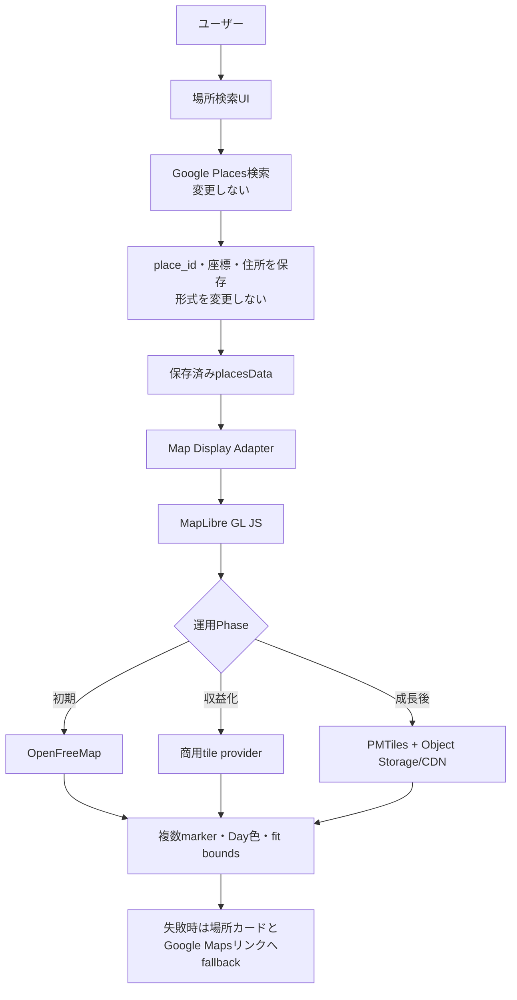

# Task 002: 地図検索を維持し、MapLibreによる段階的な地図表示基盤へ移行する

- 種別: フロントエンド / 地図 / コスト最適化 / セキュリティ
- 優先度: High
- 状態: 基本方針承認済み / 実装待ち
- 対象: 現行V2の地図表示
- 対象外: Google Placesによる検索・候補取得・Place Details、V1画面

## 目的

現在のGoogle Maps Platformを利用した場所検索機能は挙動・精度・保存データを変更せず維持し、地図描画をMapLibre GL JSへ統一する。初期段階はOpenFreeMap public instanceを利用し、収益化時には商用tile provider、利用規模拡大後にはPMTilesと自社管理のobject storage/CDNへ段階的に移行できる基盤を構築する。

画面コードとtile providerを直接結合せず、Map Display Adapterと設定によってprovider、style、tile endpointを切り替えられることを本タスクの中心要件とする。

## 必須条件

- Google Placesの検索、Autocomplete、候補選択、Place Details取得は変更しない。
- 保存済みの`place_id`、緯度、経度、住所、場所名の形式を変更しない。
- 「Google Mapsで開く」外部リンクは検索機能・導線として現状維持する。
- 地図表示だけをGoogle Maps JavaScript APIの地図描画から分離する。
- 初期段階では無料枠を超えると自動課金される表示providerを採用しない。
- attribution、ライセンス、利用規約、プライバシー、CSP、可用性を確認する。
- MapLibre本体、Map Adapter、場所データの契約はprovider移行時にも維持する。
- 商用tile providerの具体名・契約、またはPMTiles配信基盤の本番構築を行う前には、最新の料金と運用費を比較して改めてユーザー承認を得る。

## 現状の実装境界

### 変更対象候補

- `project_tabisync/templates/tabisync/content/want_list.html`
  - `google.maps.Map`で保存済みの場所を複数マーカー表示している。
  - Day別の色、filter連動、marker clickから詳細modalを開く。
- `project_tabisync/templates/tabisync/content/concierge_v2.html`
  - AIコンシェルジュの`map` componentでGoogle Maps JavaScript APIを遅延ロードし、複数地点を表示している。
- 関連する`project_tabisync/static/scss/content_V2/`と生成済みCSS。
- 地図表示のテストおよびデモ画面。

### 変更禁止領域

- `want_list.html`のAutocomplete、Text Search、Place Details処理。
- `schedule_edit.html`の場所検索処理。
- Google Placesライブラリを読み込むscriptと検索用service。ただし、表示用Mapとの分離に不可欠な初期化方法の変更は、検索の入出力と挙動を完全に維持するテストを追加した場合に限る。
- `WantToGo`、`ScheduleV2.place`などの保存モデルと既存データ。
- `build_google_maps_search_url`および「Google Mapsで開く」リンク。
- AIコンシェルジュの`show_map` Toolが行うItinerary境界チェック。

`want_list.html`では現在、可視Mapと`google.maps.places.PlacesService`が同じMapインスタンスを共有している。表示を置き換える際は検索service用のGoogleオブジェクトと可視地図rendererを分離する必要がある。この分離によって検索結果、fields、候補件数、エラー時動作を変えてはならない。

## 承認済みの段階移行方針

### Phase 1: 初期導入

- rendererはMapLibre GL JSを使用する。
- tile/style providerはOpenFreeMap public instanceを使用する。
- API key不要・表示回数制限なしという公開条件を実装開始時に再確認する。
- provider障害時は地図canvasだけを非表示にし、場所カードと「Google Mapsで開く」リンクを残す。
- OpenFreeMapを画面コードへ直接記述せず、設定とMap Display Adapter経由で利用する。

### Phase 2: 収益化開始

- 有料版または広告等による収益化の開始前に、OpenFreeMapの最新商用条件、SLA、継続性を再評価する。
- 本番の事業継続性が必要になった時点で、MapLibre互換の商用tile providerへ切り替える。
- provider選定時は最低2社について、商用利用条件、月額固定費、従量単価、超過時課金、quota、SLA、データ品質、privacy、解約・データ移行条件を比較する。
- 無料プランが商用利用不可のproviderを、収益化後も無料プランのまま使用しない。
- 具体的なproviderと契約プランは、その時点の利用量を基にユーザーへ提示し、承認後に設定する。

### Phase 3: 利用規模拡大後

- 商用providerの年間費用が自社配信の総保有コストを継続的に上回る、privacy要件が強まる、またはprovider依存が事業リスクになった時点でPMTilesへの移行を評価する。
- MapLibreは維持し、tile sourceだけをPMTilesへ切り替える。
- PMTilesはDjango/Gunicornと同じプロセスから配信しない。
- 第一候補はHTTP Range対応object storageとCDNの構成とする。自社VPSで配信する場合も、別container、別volume、reverse proxy/cache、rate limit、監視を設ける。
- 世界全体のtile生成・更新を現在のDjango VPSへ同居させない。必要地域のextractまたは生成済みPMTilesから開始する。

### provider切替時の相談事項

Phase 2またはPhase 3へ移行する前に、次をユーザーへ提示する。

1. 月間map view、tile request、転送量と成長予測。
2. 商用providerの月額・超過料金と、自社配信のstorage・request・CDN・運用人件費。
3. SLA、障害履歴、rate limit、利用停止条件。
4. API key、CORS、CSP、利用者データ送信、subprocessor。
5. attributionとライセンス。
6. 移行・rollback手順とprovider lock-in。
7. 推奨案と採用しない案の理由。

## 候補比較

以下は2026-08-07時点の公式情報に基づく。価格・規約・無料提供は変更され得るため、相談直前に再確認する。

| 候補 | 表示機能 | 収益化面 | コスト面 | 安全面・運用面 | 主な制約 |
| --- | --- | --- | --- | --- | --- |
| A. Google Maps Embed API | iframeによるplace、view、directions、streetview、search | 商用サイトで使いやすい一方、地図内に広告が表示される場合があり、表示やブランドを完全には制御できない | 公式上、全リクエストが使用量上限なし・無料。ただし有効なGoogle Cloud API keyが必要 | Googleの運用品質を利用できる。Embed専用key、API制限、website/referrer制限が必要。利用者はGoogleへ接続する | 現行のような複数の任意マーカー、Day別色、marker click連動を1枚の地図で再現しにくい。iframeは200px未満非対応 |
| B. MapLibre GL JS + OpenFreeMap public instance | vector map、複数marker、fit bounds、popup、自由なstyle | MapLibreはオープンソースでvendor lock-inを抑えやすい。OpenFreeMapは公開説明上、登録・API key・cookieなし。商用利用条件と保証は採用前に最新版を確認する | 公開instanceは公式説明上、view/request数の制限なく無料。将来の提供条件変更や寄付依存を考慮する | API key流出リスクがない。外部tile/style通信、MapLibre本体の供給網、WebGL、CSP worker設定が必要。障害時fallbackが必要 | 公開instanceのSLA・長期保証を契約で確保できない。Googleと地図データ・表記・POIが異なる |
| C. Leaflet + 外部OSM系tile provider | raster map、複数marker、fit bounds、popup。軽量で実装が比較的単純 | Leaflet自体はオープンソース。商用可否と収益化条件はtile provider側に依存する | Leafletは無料。tile配信はprovider次第で無料枠、従量課金、商用制限がある | WebGL不要で対応範囲が広い。tile providerの規約、key、ログ、SLAを個別評価する必要がある | rendererだけでは地図画像を提供しない。無料providerの選定が別途必要 |
| D. MapLibreまたはLeaflet + 自前tile配信 | B/Cと同等。データ・style・配信を自社管理 | 有料版を含めた収益化の自由度とprovider独立性が最も高い。OSM attributionとODbL等の遵守は必要 | API従量課金は避けられるが、サーバー、storage、CDN、更新、監視、人件費が発生する。「無料」ではなくインフラ費への置換 | 外部providerへの閲覧情報送信を減らせる。patch、障害対応、容量、DDoS対策を自社で負担する | 初期構築・継続運用が重く、小規模サービスでは総費用が高くなりやすい |

### 採用候補にしない構成

`tile.openstreetmap.org`または`vector.openstreetmap.org`を、商用サービスの無制限・無保証な無料tile基盤として直接固定しない。

OpenStreetMapの地図データは自由に利用できるが、OSM Foundationのtile serverは寄付によるbest-effort運用でありSLAがない。公式ポリシーには、商用サービスは予告なくアクセスを失う可能性がある旨が明記されている。通常の小規模な対話表示が直ちに禁止されるわけではないが、TabiSyncの将来の有料版を支える恒久基盤としては事業継続リスクが高い。

## 比較から採用方針への判断

### Google Maps Embed APIを初期採用しない理由

現行の複数マーカーとDay別色を維持できないため、表示rendererとしては採用しない。Google Places検索と「Google Mapsで開く」リンクは維持する。

### MapLibre GL JSとOpenFreeMapを初期採用する理由

現行の複数マーカー、Day別色、fit bounds、click操作を維持しやすく、MapLibreとtile/style providerを分離できるため採用する。将来OpenFreeMapから商用providerまたはPMTilesへ差し替えられるadapterを設ける。

公開instanceの無料提供、rate limit、SLA、商用条件が実装時点でも要件を満たすことを再確認し、停止時は地図canvasを除去して場所カードとGoogle Mapsリンクを残す。

### 初期段階からセルフホストしない理由

世界対応のtile生成・更新、storage、CDN、監視、バックアップを初期段階から負担すると、利用量が少ない時期の総保有コストが高くなるため採用しない。MapLibreとAdapterを先に導入し、実測値を得てからPMTilesへ移行する。

## 選定結果

- 相談日: 2026-08-07
- 選択した方式: MapLibreを固定rendererとする段階移行方式
- 初期renderer: MapLibre GL JS
- 初期tile/style provider: OpenFreeMap public instance
- 収益化時: MapLibre互換の商用tile providerへ設定切替。具体的なproviderは移行時に比較・承認する
- 成長後: PMTiles + HTTP Range対応object storage + CDNを第一候補として評価する
- 選択理由: 現行表示機能を維持しながら初期費用を抑え、収益化後の安定性と将来の自社配信を両立できるため
- 許容した機能差: Googleと地図データ、表記、POI、styleが異なること。検索結果と保存データはGoogle Placesを維持する
- 障害時fallback: 地図canvasを除去し、場所カードとGoogle Maps外部リンクを表示する
- ユーザー承認: 取得済み

## 実装指示

### 1. 表示adapterを作る

表示provider固有処理をテンプレート内へ散在させず、V2用の地図renderer moduleへ集約する。

想定インターフェース:

```javascript
createMapRenderer(container, {
  places,
  onMarkerClick,
  markerStyle,
  fallback,
});
```

- 入力は保存済みの`id`、`name`、`address`、`lat`、`lng`、`planned_day`などに限定する。
- providerが返すHTMLやモデル生成HTMLを直接`innerHTML`へ渡さない。
- 座標は緯度`[-90, 90]`、経度`[-180, 180]`を再検証する。
- provider URLは許可リストまたは固定設定から組み立てる。
- providerを将来差し替えられるよう、Google Places検索serviceとrendererを結合しない。
- `MAP_DISPLAY_PROVIDER`、`MAP_STYLE_URL`、必要に応じて`MAP_TILE_URL`をサーバー設定から渡し、利用者入力から変更できないようにする。
- 初期値は`openfreemap`とし、`commercial`、`pmtiles`などのprovider追加でテンプレートを分岐だらけにしない。

### 2. `want_list.html`を分離する

- Google Places検索serviceの初期化を維持する。
- 可視`#map`は選定した表示rendererへ渡す。
- 保存済み`placesData`からmarkerを生成する。
- Day別marker色、filter表示/非表示、fit bounds、marker clickで`openModal(place)`を開く挙動を維持する。
- 緯度経度のない場所はカードとGoogle Mapsリンクを維持し、markerだけを省略する。

Google Placesのために非表示のGoogle Map生成が必要な場合は、その初期化がGoogle Mapsの表示課金SKUを発生させるかCloud Consoleのmetricsで確認する。表示rendererを変更しただけでGoogle側の地図表示課金がゼロになると推測しない。

### 3. AIコンシェルジュの地図componentを変更する

- `show_map` ToolのItinerary境界検証と最大8地点を維持する。
- `ui_component`は引き続き構造化データとし、任意HTMLや任意tile URLを含めない。
- `renderMapComponent`のGoogle Maps遅延ロード部分だけを共通rendererへ置き換える。
- 場所名、住所、「Google Mapsで開く」の一覧を先に表示し、地図のロード失敗後も残す。
- localStorageにはHTMLではなく検証済みの構造化componentだけを保存する。

### 4. dependencyと静的ファイルを管理する

- rendererライブラリはversionを固定する。
- CDNを使う場合はSRI、`crossorigin`、CSP、障害時fallbackを確認する。
- 可能であればnpmで取得してビルド済みassetを自サイトから配信し、第三者CDNへの依存を減らす。
- 新しいJavaScript/CSSを追加した場合は`project_tabisync/static/`を変更し、`staticfiles/`を直接編集・commitしない。
- ライセンスnoticeと地図上のattributionを削除・非表示にしない。

### 5. セキュリティとプライバシーを設定する

- 使用するscript、style、tile、font、image、worker、iframe originだけをCSPへ追加する。
- MapLibre採用時はworker用CSP要件を確認し、必要以上に広い`blob:`許可を避けるためCSP対応bundleも比較する。
- 外部providerへ送信されるIP、Referer、座標、cookieとprivacy policyへの記載要否を確認する。
- 地図にユーザーの非公開メモ、token、パスワード、session情報を送らない。
- tile/style URLをクエリやlocalStorageから任意指定できないようにする。

### 6. コスト監視を残す

- Google Places検索の利用量と表示rendererの利用量を別々に観測する。
- Google Cloud ConsoleでMaps JavaScript、Dynamic Maps、Places関連SKUを変更前後に比較する。
- 無料providerでもリクエスト数、エラー率、読み込み時間を計測する。
- providerの無料条件変更を定期確認できる運用タスクを用意する。
- 有料化または無料枠超過が発生し得るproviderを採用した場合は、quotaと予算alertを必須にする。

### 7. PMTiles移行可能性を維持する

- Map Adapterの入力をprovider非依存にし、MapLibreのsource/style設定だけでOpenFreeMap、商用provider、PMTilesを切り替えられるようにする。
- PMTiles固有のURL、bucket名、credentialをフロントエンドへ不要に公開しない。
- 公開bucketから直接配信する場合はCORSをTabiSyncのoriginに限定し、archive全体のdownloadとegressリスクを評価する。
- server-side decoderを採用する場合はDjangoとは別serviceとし、CDNまたはreverse proxyの背後へ配置する。
- 地図データ更新はWeb request中に実行せず、version付きarchiveを作成してatomicに切り替えられるようにする。
- rollback用に直前のarchive/style versionを保持する。

## 処理構造



## テスト

### 検索機能の非回帰

- `want_list.html`で検索語から候補が表示される。
- Autocomplete失敗時のText Search fallbackが維持される。
- 候補選択後にplace name、address、place ID、lat/lngが従来どおり入力される。
- `schedule_edit.html`の場所検索が変更前と同じ動作をする。
- Google Placesへ要求するfieldsと候補上限が変わっていない。
- 手入力による場所追加・編集も維持される。

### 地図表示

- 座標を持つ1件・複数件の場所を表示する。
- Day別marker色とfilter連動を確認する。
- marker clickで正しい詳細modalが開く。
- 全地点を収めるboundsと、1地点時のzoomが適切である。
- 座標なし、不正座標、重複座標、0件でもJavaScript errorにならない。
- AIコンシェルジュの最大8地点とItinerary境界を維持する。
- provider障害、timeout、CSP拒否時に場所カードとGoogle Mapsリンクが残る。
- 設定だけでmock providerへ切り替えられ、テンプレートの検索処理へ影響しない。
- OpenFreeMap固有URLを利用者入力や保存済み場所データから上書きできない。

### セキュリティ・規約

- 任意のscript、tile、style、iframe URLを注入できない。
- attributionがdesktop/mobileの双方で常に読める。
- API keyを使用する場合、Gitへ含まれずAPI/application restrictionが設定されている。
- 別Itineraryの場所情報や非公開メモをproviderへ送信しない。
- localStorage改ざんで任意HTMLや任意providerをロードしない。
- CSPを必要最小限のoriginで通過する。

### provider切替

- `MAP_DISPLAY_PROVIDER`とstyle/source設定の変更でproviderを切り替えられる。
- provider切替後もmarker、Day色、filter、modal、fallbackの挙動が同じである。
- provider設定欠落、不正URL、取得失敗時に安全なfallbackへ移行する。
- PMTilesをmockしたHTTP Range配信で地図sourceを読み込める設計になっている。

### UI確認

- desktop、mobile、タッチ操作、keyboard操作を確認する。
- map containerに適切なaccessible nameを付ける。
- 地図を操作できない利用者向けに同等の場所一覧と外部リンクを残す。
- レイアウトシフト、初期表示時間、低速回線時のfallbackを確認する。

### 回帰コマンド

```bash
cd project_tabisync
pipenv run python manage.py check
pipenv run python manage.py test tabisync
```

SCSSを変更した場合は対応するCSSとsource mapを再生成し、`staticfiles/`はcommitしない。

## 完了条件

- 本書の承認済み段階移行方針に従っている。
- Google Placesの検索、候補選択、詳細取得、保存形式が変更されていない。
- 可視地図がMapLibre GL JS + OpenFreeMapへ移行している。
- Map Display Adapterと設定により、商用providerおよびPMTilesへ画面の再実装なしで切り替えられる。
- `want_list`とAIコンシェルジュで共通または同一契約のrendererを利用している。
- 複数marker、Day別色、filter、modal、fallbackの受け入れ条件を満たすか、承認済みの機能差が記録されている。
- 商用利用、attribution、無料条件、rate limit、SLAまたは無保証を確認・記録している。
- API key制限、CSP、privacy、dependency固定、fallbackが実装されている。
- Google Places利用量と地図表示利用量を分けて監視できる。
- 収益化時の商用provider選定と、成長後のPMTiles移行にユーザー承認ゲートが定義されている。
- 自動テストと主要画面の手動確認が完了している。

## 公式資料

- [Google Maps Embed API Quickstart](https://developers.google.com/maps/documentation/embed/quickstart): Embed APIは有効なAPI keyが必要だが、公式上は使用量上限なく無料
- [Google Maps Embed API](https://developers.google.com/maps/documentation/embed/embedding-map): iframe、表示mode、最小サイズ、広告表示の可能性、referrer設定
- [Google Maps Platform pricing](https://developers.google.com/maps/billing-and-pricing/overview): SKU、無料利用枠、課金体系
- [Google Maps Platform security guidance](https://developers.google.com/maps/api-security-best-practices): Embed専用key、API restriction、website restriction
- [MapLibre GL JS](https://maplibre.org/projects/gl-js/): オープンソースのWebGL vector map renderer
- [MapLibre GL JS documentation](https://maplibre.org/maplibre-gl-js/docs/): package導入とCSP worker要件
- [OpenFreeMap](https://openfreemap.org/): public instanceの無料提供、登録・API key・cookie不要という公式説明
- [Leaflet](https://leafletjs.com/): オープンソースのinteractive map library。tile providerは別途必要
- [OpenStreetMap Tile Usage Policy](https://operations.osmfoundation.org/policies/tiles/): attribution、cache、禁止事項、best-effort、商用利用時の停止リスク
- [OpenStreetMap Vector Tile Usage Policy](https://operations.osmfoundation.org/policies/vector/): vector tileの利用条件、無保証、停止リスク
- [PMTiles Concepts](https://docs.protomaps.com/pmtiles/): HTTP Range Requestで配信する単一file archive
- [PMTiles Cloud Storage](https://docs.protomaps.com/pmtiles/cloud-storage): object storage、CORS、request・転送コスト
- [Martin Tile Server](https://maplibre.org/martin/sources-files/): MBTiles/PMTilesを別serviceで配信する選択肢

本書は2026-08-07時点の公開情報を参照している。選定相談と実装開始の直前に、料金、商用条件、利用規約、rate limit、SLAを再確認すること。
