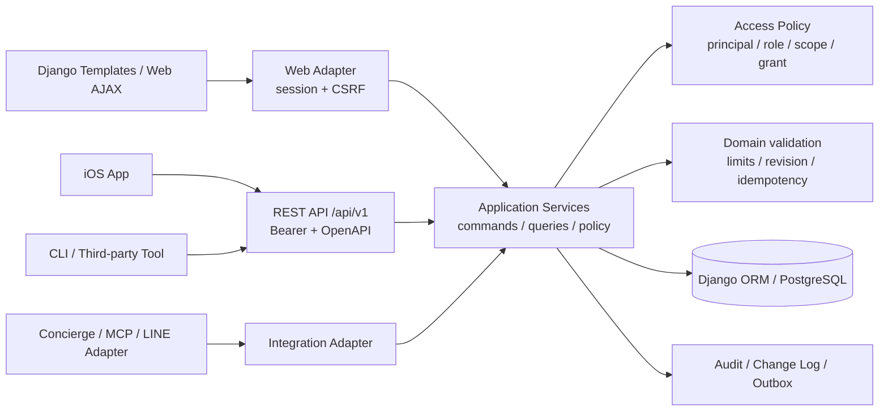

# Task 011: iOS・外部ツール向けのAPI基盤を整備する

- 種別: アーキテクチャ / API / 認証・認可 / 同期 / 運用
- 優先度: High（API実装前のランタイム・認証基盤を含む）
- 状態: 方針策定済み / 未実装
- 対象: 現行V2の`Itinerary`、`ScheduleV2`、`WantToGo`、`MemoV2`、`ChecklistV2`と、将来のiOSアプリ・外部ツール・LINE/MCP等のAdapter
- 対象外: V1の削除・移行、iOSアプリ本体の実装、公開Developer Portal、無審査の第三者連携、既存共有URLの即時廃止
- 調査日: 2026-08-25
- 関連方針: `docs/product-strategy.md`の「Web/LINEから共通domain serviceを呼ぶ」「権限/token lifecycle」「行単位操作、version/conflict」を具体化する

## 1. 結論

TabiSyncでは、別のAPIサーバーや別DBを新設せず、**現在のDjango/PostgreSQLをモジュラーモノリスとして維持し、V2の操作をHTTP非依存のApplication Serviceへ先に抽出したうえで、Django REST Framework（DRF）のversioned REST APIを薄く載せる**構成を採用する。

中核方針は次のとおり。

1. APIは`/api/v1/`へ分離し、画面機能の「V2」とAPI versionの`v1`を結び付けない。
2. Web画面、公開API、AIコンシェルジュ、将来のLINE/MCP/Webhook Adapterは、同じApplication Serviceを呼ぶ。
3. 現行の`Itinerary.token`、閲覧・編集パスワード、Django sessionは匿名Web互換として維持するが、APIのBearer credentialには流用しない。
4. APIリソースには秘密でない`public_id`を追加し、内部DBの整数PKと共有URL用tokenを公開識別子から分離する。
5. iOSの本番認証はRFC 8252/RFC 9700に従うAuthorization Code + PKCE（`S256`）とし、外部ブラウザで認証する。アプリ内へclient secretを埋め込まない。
6. 個人CLIや管理者自身の自動化には、対象しおり・scope・期限を限定し、平文を一度だけ表示するPersonal Access Token（PAT）を補助的に提供する。
7. access token/PATはランダムなopaque tokenを第一候補とし、DBには平文を保存しない。JWTは複数resource serverで自己完結検証が必要になるまで採用しない。
8. OpenAPI 3.1を契約としてcommitし、Swift OpenAPI Generatorで型安全なiOS clientを生成できる状態にする。
9. 複数端末・オフライン・再送に備え、`revision`、ETag/`If-Match`、`Idempotency-Key`、cursor change feed、削除tombstoneを段階的に導入する。
10. MCP、Webhook、Bot固有の操作をAPIの正本にしない。REST APIまたは同じApplication Serviceへ接続する薄いAdapterとして追加する。

最初にDRFを追加するのではなく、**サポート終了済みのPython 3.8 / Django 4.2からの更新と、共通serviceへのロジック集約が先行条件**である。

## 2. 目的

将来のクライアントがWeb画面の内部実装へ依存せず、安全かつ一貫して次を行える基盤を作る。

- iOSアプリから既存しおりを読み込み、権限の範囲内で編集する。
- iOSで通信断や再送が発生しても、二重作成や意図しない上書きを防ぐ。
- 個人CLI、ショートカット、自動化ツールから、対象しおりだけを限定操作する。
- 第三者サービスへ、利用者同意・scope・失効を備えたアクセスを委任する。
- AI/MCP経路では、既存の「変更候補」と「確認後の適用」の分離を維持する。
- Web・API・AI・外部Adapterの間で、認可、上限、入力検証、transaction、監査が分岐しない。
- OpenAPIからiOS clientと外部向けドキュメントを生成し、契約変更をCIで検出する。

## 3. 今回は行わないこと

- 現行のDjango Templates、V2画面、Vanilla JavaScriptを置き換えない。
- APIのためにFastAPI等の別serviceや別DBを追加しない。
- V1モデル・URL・テンプレートを削除またはAPIへ展開しない。
- 現行の画面用JsonResponse endpointをそのまま外部公開しない。
- `csrf_exempt`を付けて既存Cookie/session endpointを外部API化しない。
- GraphQLを初期APIに採用しない。
- MCPをiOSを含む全client共通のtransportにはしない。
- URL query/pathへAPI tokenを入れない。
- 長寿命JWT、全しおり共通API key、iOSバイナリ内のclient secretを使わない。
- AIや第三者toolへ確認なしの強い編集権限を既定付与しない。
- App Store公開、Push通知、全面リアルタイム同期までをAPI初回releaseの完了条件にしない。

## 4. 現行構成の調査結果

### 4.1 ランタイムと依存関係

| 項目 | 現状 | API対応上の判断 |
|---|---|---|
| Python | `Pipfile`と`containers/django/Dockerfile`が3.8 | Python 3.8は2024-10-07にEOL。API依存追加前に更新する |
| Django | `Pipfile.lock`は4.2.29 | Django 4.2 LTSは2026-04-07にsupport終了。5.2 LTSへ更新する |
| dependency指定 | `Pipfile`の主要packageが`*`、lockで実体を固定 | 互換範囲を明示し、lock差分をreviewする |
| API framework | DRF、OAuth provider、OpenAPI generatorなし | runtime更新後にDRFとdrf-spectacularをpinして追加する |
| cache | `CACHES`設定なし | 既定LocMemCacheはprocessごとに分離。Redis等の共有cacheを追加する |
| server | 同期Django View + Gunicorn | 初期REST APIには十分。APIのためだけにasync/microservice化しない |

2026-08-25時点の検証開始候補は、Python 3.13の最新patch、Django 5.2 LTSの最新patch、DRF 3.17.2、DRF 3.17対応のdrf-spectacularである。DRF 3.18はDjango 4.2 supportを削除済みで、調査時点のdrf-spectacular公式互換表はDRF 3.17までのため、OpenAPIと生成Swift clientを含む互換テストなしに3.18へ上げない。実装開始日にも最新版とsecurity advisoryを再確認し、全versionをlockする。

### 4.2 現行の「JSON API」は画面内AJAXである

`project_tabisync/tabisync/urls.py`には独立したAPI namespaceやversionがない。JSONを返す更新処理も、すべて`content/v2/<pk>/<token>/...`というHTML画面のURL配下にある。

| 機能 | 現行入口 | 現状の制約 |
|---|---|---|
| 予定 | `schedule/row-save/`、`row-delete/` | POSTによるRPC型。readはHTMLだけ。saveはid有無でcreate/updateを兼ねる |
| 行きたい場所 | `WantToGoV2View.post` | `action=save/update/delete_want_to_go`を1 endpointへ送るRPC型。readはHTMLだけ |
| メモ | `MemoV2View.post` / `MemoV2EditView.post` | notes配列全体を置換。表示用/編集用Viewに保存処理が重複 |
| チェックリスト | `ChecklistV2View.post` / `ChecklistV2EditView.post` | JSON blob全体を置換。GETがdefault rowを保存することがある |
| AI | `ConciergeV2View.post` / `concierge_v2_apply_changes` | chatと変更適用。clientが`edit_actions`配列を送り返す |
| しおり本体 | form POSTのみ | JSON read/create/updateは存在しない |

これらは以下に依存するため、公開APIとして扱わない。

- URL内の整数`pk`と共有UUID `token`
- 閲覧・編集パスワード認証後のDjango Cookie session
- 同一origin JavaScriptとCSRF token
- HTML redirect/404とJsonResponseが混在するerror contract
- endpointごとに異なる`status`、`message`、HTTP method、response shape

`views/utils.py::parse_json_object_body`が持つContent-Type、256KiB、UTF-8、top-level objectの検証方針は維持するが、APIではDRF parser/serializerと共通exception handlerへ移す。

### 4.3 現行認証・認可

- `Itinerary`は、共有URL用`token`、閲覧/編集パスワードhash、reset email、blog埋込専用`blog_embed_token`を同一modelに持つ。
- 通常画面は`{pk, token}`で対象しおりを解決する。
- パスワード成功後はview/edit別のDjango session keyへ認可状態を保存する。
- password hashのfingerprintをsession keyに含めるため、password変更後に旧sessionが失効する既存設計は良い。
- `view_password`または`edit_password`が未設定なら、その権限は自動的に許可される。特にedit password未設定では共有URL所持者が編集できる。
- `blog_embed_token`は通常共有tokenと分離されている。この用途分離は維持する。
- account、owner、member、API client、Bearer、OAuth、scope、端末単位の失効は未実装である。

現行の共有tokenはURL、QR、ブラウザ履歴、共有先、アクセスログ等へ現れ得る長寿命credentialで、用途別の個別失効もできない。これをAPI Bearerへ再利用すると漏えい面と権限がさらに広がるため禁止する。

### 4.4 再利用すべきドメイン資産

以下はAPIでも維持すべき強みである。

- 全child queryを現在の`Itinerary`で絞るIDOR防止パターン。
- `views/itinerary_helpers.py::lock_itinerary_for_update`と`transaction.atomic()`による上限競合防止。
- 1日15予定、行きたい場所数、メモ、チェックリスト、JSON本文、画像容量等のserver-side上限。
- `apply_want_to_go_payload`の座標、Day、priority等の共通検証。
- scheduleの日付計算、上限、並び替え。
- `normalize_memo_v2_notes`、`normalize_checklist_v2_content`と各上限検証。
- `concierge_tools/edit_actions.py`のItinerary scope、atomic batch、確認後適用。
- Agent Toolがclient/モデル指定のpkやtokenを受けず、server側contextからItineraryを得る設計。
- 非DEBUG時に内部例外や外部API詳細を返さない方針。
- `TRUSTED_PROXY_CIDRS`を用い、直前hopが信頼済みの場合だけ転送IP headerを採用する処理。

ただし現在は多くが`views/`配下にあり、`JsonResponse`を直接返す関数やAI専用処理と混在している。API Viewから既存Viewを呼ぶのではなく、HTTP非依存のserviceへ移す。

### 4.5 API同期を阻むデータ構造

| 課題 | 現状 | 必要な対応 |
|---|---|---|
| 公開ID | ItineraryのUUIDは秘密共有token。childは整数PKだけ | 非秘密の`public_id UUID`を各API resourceへ追加し、内部PKは維持 |
| timestamp | Itineraryだけcreated/updated、WantToGoはcreatedのみ、他childはなし | resourceごとにcreated/updatedを追加 |
| revision | version/revisionなし | resourceとaggregateへ単調増加revisionを追加 |
| aggregate更新 | child更新でItinerary.updated_atは変わらない | transaction内でaggregate revisionを更新 |
| 削除差分 | 物理deleteのみ | change logにtombstoneを残す |
| Memo | notes配列をCKEditor5FieldへJSON文字列保存。note IDなし | `MemoNote`へ正規化。移行中だけsingleton+ETag全置換 |
| Checklist | list/itemをTextField内JSONとして全置換 | `ChecklistGroup` / `ChecklistItem`へ正規化 |
| Checklist ID | normalizerが欠落IDをread時に生成し得る | migrationで安定IDをbackfillし、readでIDを生成しない |
| Schedule | `date`と`day_index`が併存 | APIでは`day_index`を入力の正本とし、calendar dateはserver算出 |
| 時間帯 | 全体設定はAsia/Tokyo、Itinerary timezoneなし | ItineraryにIANA timezoneを追加し、local date/timeの意味を固定 |
| actor/audit | 編集者の個人帰属なし | principal/client/sourceをmutation auditへ記録 |

## 5. 採用アーキテクチャ



### 5.1 モジュラーモノリスを維持する理由

- Itinerary配下の複数rowを一つのtransactionで更新する既存要件が多い。
- PostgreSQLのrow lockとDjango ORMを既に安全に利用している。
- iOSや外部toolはHTTP契約を必要とするが、別process・別DBを必要としていない。
- 個人開発規模でmicroserviceを追加すると、認証、分散transaction、deploy、監視の面が増える。
- 将来負荷分離が必要になっても、Application ServiceとOpenAPI契約が境界になる。

### 5.2 Application Serviceの契約

Serviceは`HttpRequest`、Django session、`JsonResponse`、templateを受け取らない。概念上、次を入力とする。

```text
ActorContext
  principal_id / principal_type
  client_id / credential_id
  itinerary_id
  role
  scopes
  source (web / ios / api / concierge / line / mcp)

Typed command/query
  resource public_id
  validated fields
  expected_revision
  idempotency context
```

ServiceはDTOを返し、次のdomain exceptionを送出する。

- `ValidationError`
- `NotFoundError`
- `PermissionDeniedError`
- `ConflictError`
- `LimitExceededError`
- `IdempotencyConflictError`

Web Adapterは既存の日本語HTML/JsonResponseへ、API AdapterはHTTP statusとProblem Detailsへ変換する。transaction、row lock、件数上限、revision更新、audit/change eventはcallerではなくservice自身が所有する。

### 5.3 推奨ディレクトリ

```text
project_tabisync/tabisync/
├── api/
│   └── v1/
│       ├── urls.py
│       ├── authentication.py
│       ├── permissions.py
│       ├── serializers.py
│       ├── views.py
│       ├── pagination.py
│       ├── exceptions.py
│       └── schema.py
├── services/
│   ├── context.py
│   ├── errors.py
│   ├── itineraries.py
│   ├── schedules.py
│   ├── places.py
│   ├── memos.py
│   ├── checklists.py
│   ├── proposals.py
│   ├── changes.py
│   └── audit.py
└── integrations/
    ├── mcp/        # 必要になった時だけ
    ├── line/       # 必要になった時だけ
    └── webhooks/   # 必要になった時だけ
```

実装時にファイル分割を調整してよいが、`api -> services -> models`の依存方向を維持する。`services`から`views`をimportしない。

### 5.4 最初に抽出するservice

1. `ItineraryService`
   - create、基本情報更新、日程変更、既存Scheduleの日付shift、画像更新制限。
2. `ScheduleService`
   - list、create、update、delete、同一Itineraryのplace解決、1日上限、並び順。
3. `WantToGoService`
   - list、create、update、delete、件数上限、座標/Day/priority検証。
4. `MemoService` / `ChecklistService`
   - read normalization、上限、移行期のrevision付き全置換、正規化後のrow操作。
5. `ChangeProposalService`
   - AI/tool由来の候補検証、base revision、期限、確認後適用。
6. `ItineraryQueries`
   - API、Web、Conciergeで再利用できるDTO。AI向けfield subsetはAdapter側で絞る。

`concierge_tools/edit_actions.py`はservice候補だが、Webのschedule/place処理と別実装になっており、文字列のsilent truncation等の意味差もある。最終的には共通domain commandを呼ぶAdapterへ縮小する。

## 6. API方式

### 6.1 REST + DRFを採用する

DRFを採用する理由は次のとおり。

- Django ORM、serializer、authentication、permission、throttle、pagination、test clientと統合できる。
- endpointごとの手書きJSON parse/errorを減らせる。
- drf-spectacularからOpenAPIを生成し、Swift client生成へ接続できる。
- resource単位の認可とItinerary scopeを明示しやすい。
- 既存Django projectへ段階的に追加できる。

初期段階でGraphQLを採用しない理由は、権限・query cost・cache・offline conflict・schema公開面が増え、現在必要なCRUDと同期に対して複雑さが上回るためである。Django Ninja等も候補にはなるが、認証・permission・throttle・client生成を含む既存Djangoとの総合的な統合性からDRFを既定とする。

### 6.2 URL versioning

- base pathは`/api/v1/`とする。
- DRFの`NamespaceVersioning`または`URLPathVersioning`を全APIで統一する。
- v1内で許可する変更は、optional field追加、endpoint追加、enum追加時のfallback等の後方互換変更だけとする。
- field削除、型変更、意味変更、必須化、認証方式の破壊的変更は`/api/v2/`へ送る。
- App Store更新には時間差があるため、旧major versionの終了日、移行期間、利用client数を確認してから廃止する。
- deprecation時は文書、response header、client管理画面で告知し、突然停止しない。

### 6.3 OpenAPIをclient契約にする

- OpenAPI 3.1を採用する。
- drf-spectacularでschemaを生成し、`openapi/tabisync-api-v1.yaml`等へsnapshotをcommitする。
- serializerから自動生成するだけでなく、安定した`operationId`、scope、全status、pagination、error、exampleを明示する。
- CIでschema validationと前回snapshotとの差分を検査する。
- breaking change検出なしにschema snapshotを更新しない。
- exampleへ実在token、住所、メール、位置情報、会話本文を入れない。
- iOSはSwift OpenAPI Generatorでbuild時にclientを生成し、UIからは薄い手書きRepository層越しに利用する。
- 生成codeをUIへ直接広げず、API version更新時の影響をRepository内へ閉じ込める。

DRF内蔵OpenAPI generatorは非推奨のため、drf-spectacularをpinして用いる。drf-spectacular自身もschema変更の可能性を明示しているため、dependency更新時はschema diffとSwift client compileを必須にする。

### 6.4 responseとerror

成功responseはresourceごとの明示schemaとし、serializerでfield allowlistを定義する。`ModelSerializer(fields="__all__")`、`model_to_dict`、modelの無差別JSON化は禁止する。

特に`Itinerary`は通常データと次の秘密・個人情報を同じmodelに持つため、明示allowlistが必須である。

- `token`
- `blog_embed_token`
- `view_password`
- `edit_password`
- `reset_email`
- QR/内部media path
- 内部quota・運用fieldのうちclient契約に不要なもの

これらはowner向け通常responseにも原則含めない。share linkやPATの平文secretは作成直後の一度だけ返し、再表示しない。`ConciergeChatLog`と`ConciergeToolCallLog`も通常API対象外とする。

errorはRFC 9457に沿う`application/problem+json`へ統一する。

```json
{
  "type": "https://tabisync.com/problems/revision-conflict",
  "title": "Resource was changed",
  "status": 412,
  "detail": "最新の内容を取得してから再度お試しください。",
  "code": "revision_conflict",
  "request_id": "01...",
  "errors": {
    "title": ["30文字以内で入力してください。"]
  }
}
```

- clientは`detail`の日本語文言をparseせず、`code`とfield keyで分岐する。
- 非DEBUG環境でstack trace、SQL、内部class名、外部API response、secretを返さない。
- statusは最低限`400/401/403/404/409/412/415/422/428/429/500/502/503`をschema化する。
- validation statusを`400`または`422`のどちらにするかは実装ADRで一つに固定し、endpointごとに変えない。

### 6.5 初期resourceとendpoint

APIの`v1`は旧画面のV1/V2とは独立した契約である。

| Phase | Method / path | 主scope | 備考 |
|---|---|---|---|
| 1 | `GET /api/v1/itineraries/{itinerary_id}` | `itinerary:read` | 非秘密fieldだけ |
| 1 | `GET /api/v1/itineraries/{itinerary_id}/snapshot` | `itinerary:read` | iOS bootstrap用。server time、revision、cursorを含む |
| 1 | `GET /api/v1/itineraries/{itinerary_id}/schedules` | `schedules:read` | 安定順序、cursor pagination |
| 1 | `GET /api/v1/itineraries/{itinerary_id}/places` | `places:read` | 座標は権限・契約方針に従う |
| 1 | `GET /api/v1/itineraries/{itinerary_id}/memo` | `notes:read` | 移行期singleton read |
| 1 | `GET /api/v1/itineraries/{itinerary_id}/checklist` | `checklists:read` | 移行期singleton read |
| 2 | `PATCH /api/v1/itineraries/{itinerary_id}` | `itinerary:write` | 日程変更はserviceで関連rowも更新 |
| 2 | `POST /.../schedules` | `schedules:write` | `Idempotency-Key`必須 |
| 2 | `PATCH/DELETE /.../schedules/{schedule_id}` | `schedules:write` | `If-Match`必須 |
| 2 | `POST /.../places` | `places:write` | `Idempotency-Key`必須 |
| 2 | `PATCH/DELETE /.../places/{place_id}` | `places:write` | `If-Match`必須 |
| 2 | `PUT /.../memo` | `notes:write` | 正規化まで全置換+`If-Match` |
| 2 | `PUT /.../checklist` | `checklists:write` | 正規化まで全置換+`If-Match` |
| 3 | row単位notes/checklist endpoint | 対応write scope | JSON blob正規化後に追加 |
| 3 | `GET /.../changes?cursor=...` | `itinerary:read` | delta syncとdelete tombstone |
| 4 | `POST /api/v1/itineraries` | `itinerary:create` | account/manager bootstrap確定後 |
| 4 | change proposal作成/適用 | `changes:propose/apply` | AI/MCPはapplyを既定付与しない |

初回APIでgenericな`action` endpointや、生の`edit_actions`配列を汎用更新APIとして公開しない。予定・場所等の通常操作はresource別endpointへ分ける。

`snapshot`はiOS初期同期の往復を減らすためのread modelであり、複数resourceを一括更新するwrite endpointにはしない。サイズ上限を持ち、将来データ量が増えた場合は個別cursorへfallbackできる契約にする。

### 6.6 fieldの意味

- 全API resourceは`id`として非秘密UUID `public_id`を返す。整数PKは返さない。
- `created_at`、`updated_at`はRFC 3339 UTC timestampを返す。
- ItineraryはIANA `time_zone`を返す。
- Scheduleの入力は`day_index`とlocal `start_time`/`end_time`を基本とする。
- Scheduleの`calendar_date`はItineraryの開始日と`day_index`からserverが算出し、clientから矛盾する二重入力を受けない。
- `WantToGo.place_id`はAPI上で`provider_place_id`等の名前にし、API resource IDとの混同を避ける。
- 緯度経度は数値範囲を厳格検証し、不正値を黙って`None`へ丸めない。
- title/description/icon/place ID等を黙って切り詰めたりdefault化せず、field errorとして拒否する。
- GETはDBを変更しない。未作成Checklistのdefaultはresponse上で返すだけにする。

## 7. 認証・認可

### 7.1 WebとAPIの認証境界

| client | 認証方式 | CSRF | 用途 |
|---|---|---|---|
| 現行Web | 共有URL + password + Django session | 必須 | 既存匿名Web互換 |
| 同一origin Web AJAX | Django session | 必須 | 既存画面。段階的にserviceへ接続 |
| iOS / server tool | `Authorization: Bearer` | 不要 | `/api/v1/` protected resource |
| OAuth authorization/consent画面 | browser session | 必須 | 外部ブラウザで本人・権限確認 |
| Webhook受信 | provider固有署名 | 対象外 | Bearer認証と別の信頼境界 |

APIのprotected resource endpointではCookie sessionをauthentication methodへ混在させず、Bearerだけを受ける。OAuth/connectionのbrowser画面は既存CSRF保護を維持する。

### 7.2 principal、role、scope

長期的には次を区別する。

- `Account`: 複数端末・復旧・第三者同意を持てる本人identity。
- `ItineraryParticipant`: accountなしWeb参加者。必要な人だけAccountへlinkできる。
- `IntegrationClient`: iOS first-party client、第三者app、個人automation、service account。
- `ItineraryMembership`: AccountとItineraryの持続的なrole（owner/editor/viewer）。
- `ItineraryAccessGrant`: 対象Itinerary、principal/client、role/scope、期限、失効を表す認可grant。
- `ApiCredential`: grantを提示するaccess/refresh/PAT credential。認可と秘密文字列を分離する。

APIでの実効権限は、概念上次の積集合とする。

```text
membership / participant role
∩ access grant scopes
∩ client policy
∩ endpoint permission
```

初期scope候補:

- `itinerary:read`
- `itinerary:write`
- `schedules:read`
- `schedules:write`
- `places:read`
- `places:write`
- `notes:read`
- `notes:write`
- `checklists:read`
- `checklists:write`
- `changes:propose`
- `changes:apply`
- `concierge:use`
- `media:read`
- `media:write`
- `integrations:manage`

editor用credentialにはreadと必要なwrite scopeを明示付与し、暗黙のrole継承へ依存しない。AI費用を伴う`concierge:use`、外部連携管理、変更適用は通常編集から分離する。`*` scopeを既定発行しない。

### 7.3 token方針

- 256bit以上のCSPRNGで生成したopaque secretを使う。
- prefixを付け、利用者とlog redactionが種類を識別できるようにする。例: `ts_pat_...`、`ts_at_...`。
- 平文は発行時に一度だけ表示する。
- DBには検索用prefixとHMAC-SHA-256等のdigestだけを保存する。
- constant-time比較を使う。
- `client_id`、grant、対象Itinerary、scopes、created/expiry/revoked/last_used、発行元credentialを保持する。
- access tokenは短命にする。
- refresh tokenはrotationし、再利用検知時にtoken familyを失効する。
- password変更、share grant失効、membership削除、端末紛失、revoke-all時に派生credentialも失効できるようにする。
- Authorization header、refresh token、PAT、Cookie、password、reset linkをapplication/proxy/traceへ記録しない。
- Bearer responseは共有cacheへ保存させず、private dataには`Cache-Control: no-store`を基本とする。

DRF標準`TokenAuthentication`は単純で、1 user複数端末、scope、期限、rotation、hash-only storageを満たさないため、そのまま採用しない。

### 7.4 PAT / 個人automation

個人CLIや自身のShortcut用にはPATを許可できる。

- 作成者が管理権限を再確認したWeb画面から発行する。
- token名、対象Itinerary、scope、期限を必須にする。
- 既定期限は短くし、無期限は管理者が明示選択した場合だけにする。
- 一覧ではprefix、作成日、最終利用、scope、期限だけを表示する。
- 端末/連携単位で個別revokeできる。
- edit password未設定のlegacy itineraryでは、URL所持だけを根拠に永続write PATを発行しない。先にpassword設定またはAccount/Manager claimを求める。
- view linkだけでowner/managerをclaimできない。

### 7.5 iOS本番認証

iOSの一般提供前に、Authorization Code + PKCE（`S256`）を実装する。

- native appはpublic clientとして登録する。
- `ASWebAuthenticationSession`等のexternal user-agentを使い、埋込WebViewでpasswordを入力させない。
- redirect URIは完全一致で登録する。Universal Linkを優先し、custom schemeを使う場合もreverse-domain形式とcallback検証を行う。
- appへclient secretを埋め込まない。埋め込まれたsecretをclient認証とはみなさない。
- implicit grantとresource owner password grantを使わない。
- access tokenは短命、refresh tokenはrotation/reuse detection付きにする。
- tokenはiOS Keychainへ保存し、`UserDefaults`や平文fileへ保存しない。
- logout、端末削除、権限変更、全端末失効をserver側で実行できるようにする。

OAuth protocolを独自実装しない。Django OAuth Toolkit（DOT）またはmanaged IdPをADRで比較し、Django内でAccount/Membershipを正本にする場合はDOTを第一候補とする。DOT 3.4を採用する場合、legacy互換のため既定FalseのRFC 9700 compliance gateがあるので、次を設定と`manage.py check --deploy`で明示的に強制する。

- PKCE required、`S256`のみ
- implicit/password grant拒否
- exact redirect URI、wildcard拒否
- HTTPS scheme
- refresh rotationとreuse protection
- query string access token拒否
- hash-only token storageとgrace periodの整合

Accountを全Web利用者へ強制する必要はない。匿名Webは維持し、持続的なiOS利用、複数端末復旧、第三者OAuth consentが必要な利用者だけAccountへupgradeできる設計とする。Account/custom `AUTH_USER_MODEL`/external IdPの選定は後からの変更費用が高いため、最初のOAuth migration前にADRを確定する。

### 7.6 status codeとobject scope

- credentialなし・不正・失効済み: `401` + `WWW-Authenticate: Bearer`
- credentialは有効だがscope不足: `403`
- 別Itineraryのresource ID: scope内querysetから見つからない`404`
- rate limit: `429` + `Retry-After`
- stale revision: `412`
- `If-Match`未指定: `428`

全child lookupは必ず認可済みItineraryのquerysetから行う。clientが指定したItinerary IDとchild IDを別々にglobal queryして後で比較する実装は避ける。

## 8. iOS・オフライン同期

### 8.1 revisionとETag

- Itinerary aggregateと更新可能resourceへ整数`revision`を追加する。
- create時はrevision 1とし、更新成功ごとにtransaction内でincrementする。
- child mutation時はresource revisionとItinerary aggregate revisionを同じtransactionで更新する。
- GET responseへ`ETag`を付ける。
- PATCH/PUT/DELETEは`If-Match`を必須とする。
- header欠落は`428 Precondition Required`、不一致は`412 Precondition Failed`を返す。
- clientは最新resourceを取得し、ユーザーへ差分/競合を示してからretryする。
- `select_for_update`は上限・並び順の整合に引き続き使うが、last-write-wins検出をrevisionの代わりにしない。

### 8.2 冪等性

- retryで二重作成し得るPOSTと採用/action系endpointは`Idempotency-Key`を必須にする。
- keyはclient/grant/endpoint単位でscopeする。
- 同じkey + 同じrequest hashは保存済み結果を返す。
- 同じkey + 異なるrequestは`409 idempotency_conflict`とする。
- idempotency recordにrequest body全文やsecretを保存せず、hash、status、最小response、expiryを保存する。
- record作成とdomain mutationを同じtransactionまたは確実な一意制約で守る。

### 8.3 初期同期と差分同期

Phase 1は`GET .../snapshot`によるfull refreshから開始する。resourceに安定ID/revision/timestampが揃った後、次を追加する。

```text
GET /api/v1/itineraries/{id}/changes?cursor=<opaque>

response:
  next_cursor
  has_more
  changes[]
    aggregate_revision
    resource_type
    resource_id
    operation (upsert/delete)
    resource_revision
    changed_at
```

- cursorはserverが生成するopaque値とする。
- deleteはchange log内のtombstoneで通知する。
- change logの保持期間を超えたcursorには`sync_reset_required`を返し、snapshotを取り直させる。
- `updated_since` timestampだけの同期は、同一時刻、clock精度、deleteを安全に扱えないため正本にしない。
- collection responseは安定したunique orderingとcursor paginationを使う。
- iOS local storeではAPI public IDをkeyにし、server revisionを保持する。

### 8.4 Memo / Checklistの移行

短期のread-only APIは既存JSONを正規化して返せる。ただしwrite/offline同期は次の順にする。

1. 既存JSONの不正形、欠落ID、重複IDを調査する。
2. stable UUIDをbackfillするadditive migrationを作る。
3. 移行期はsingleton `GET/PUT` + revision/ETagで全置換競合を防ぐ。
4. `MemoNote`、`ChecklistGroup`、`ChecklistItem`へrow正規化する。
5. Web UIを新serviceへ切り替え、旧JSON fieldを互換readする期間を置く。
6. row単位APIとchange feedを公開する。
7. 利用データとrollback期間を確認するまで旧fieldを削除しない。

## 9. AI、MCP、外部tool

### 9.1 通常tool

明示的にwrite scopeを与えられたCLI等はresource別APIを直接利用できる。ただしgrantは対象Itineraryへ限定し、全操作をauditする。

### 9.2 AI/MCP

AIまたは自然言語toolには`changes:propose`だけを既定付与し、`changes:apply`を分離する。

- proposalはbase aggregate revision、提案action、作成client、期限、digestを持つ。
- proposal作成時に現在と同じvalidationを行うがDB本体を変更しない。
- apply時に本人/編集scope、proposal digest、期限、最新revision、件数上限を再検証する。
- stale proposalは自動適用せず、再提案を求める。
- applyはatomicかつidempotentにする。
- AI modelへtoken、password、session、API key、不要な個人情報を渡さない。

MCP serverを追加する場合も、`get_itinerary`、`list_schedules`、`propose_changes`等の狭いToolをAPI/Application Serviceへmapする。MCP serverがORMを直接操作したり、独自の認可・上限を持ったりしない。

### 9.3 Webhook

外部toolへ変更通知が必要になった場合だけoutbound webhookを追加する。

- subscription作成は`integrations:manage`を必須にする。
- eventはtransactional outboxから非同期配信する。
- payloadへ共有token、password、memo全文等を不要に含めない。
- endpointごとのsecretでHMAC署名し、timestampとdelivery IDを含める。
- retryは同じdelivery IDで冪等にする。
- redirect、DNS、private/link-local/metadata IP、response size、timeoutを制限してSSRFを防ぐ。
- delivery logはstatus、latency、attempt、error categoryだけを保持し、secret/body全文を保存しない。
- webhookは初回API releaseの必須範囲にしない。

## 10. Rate limit、CORS、media

### 10.1 rate limit

rate limitは三層に分ける。

1. Cloudflare/Nginx: DDoS、異常IP、connection、body size。
2. DRF: credential/client/Itinerary/endpoint別のburstとsustained limit。
3. DB上の厳密quota: AIや課金外部API等、並行時にも超過してはならない枠。

DRF throttleはbusiness policyと軽い濫用防止に使い、DDoS/security境界とはみなさない。DRF標準throttleはcache上の非atomic処理でraceを許容するため、厳密quotaには使わない。

- Redis-backed shared cacheを用いる。
- authenticated requestはcredential/principal/client/Itineraryをkeyにする。
- unauthenticated endpointだけ既存`get_client_ip()`をfallbackにする。
- `NUM_PROXIES`へ単純移行せず、既存`TRUSTED_PROXY_CIDRS`判定を再利用する。
- 429へ`Retry-After`を付ける。
- 通常testでrate limitを無効化しても、専用Redis testで発火、key分離、expiryを確認する。

現行schedule row save/deleteにはrate-limit decoratorがなく、既存django-ratelimitはblock時に403となり得る。APIでは権限不足403とrate limit 429を明確に分ける。

### 10.2 CORS

初期状態ではCORSを有効化しない。

- native iOSのURLSessionにはbrowser CORSが適用されない。
- server-to-server toolにも不要である。
- 同一originの現行Webにも不要である。

別originのbrowser appが確定した場合だけ`django-cors-headers`等を追加し、`/api/v1/`に限定した明示origin allowlist、必要最小method/header、`CORS_ALLOW_CREDENTIALS=False`を使う。wildcard originやsession CookieのSameSite緩和を行わない。`ALLOWED_HOSTS`、`CSRF_TRUSTED_ORIGINS`、CORSは別の制御である。

### 10.3 media

- cover imageはBearer認可を通るmedia endpointまたは短寿命signed URLで返す。
- private image responseをpublic CDN cacheへ載せない。
- uploadはmultipart endpointへ分離し、既存の容量、Content-Type、Pillow verify、1日1回制限を同じserviceで適用する。
- storage pathや共有tokenをAPI responseへ出さない。

## 11. セキュリティ要件

- TLSを必須にし、HTTPではcredentialを受け付けない。
- API pathには非秘密public IDだけを使う。
- token、password、reset linkをURLへ入れない。
- serializerは明示field allowlistとし、mass assignmentを防ぐ。
- 全child queryを認可済みItineraryへscopeする。
- roleだけでなくscopeとclient policyを毎request確認する。
- token発行・交換endpointはIP、credential、Itinerary、client単位で制限する。
- password/token検証結果の差から対象存在を列挙できないerrorにする。
- API response、OpenAPI example、log、trace、metricへ秘密値を出さない。
- raw request pathには現行共有tokenが含まれ得るため、access log/trace名はroute templateへ正規化する。
- 座標、住所、メモ、チェックリスト、AI会話は必要最小限だけ返す。
- Google Places由来fieldをiOS/外部APIへ再配布・保存する前に、`docs/product-strategy.md`で指摘済みの契約・attribution・保存期間監査を完了する。
- productionではJSON rendererだけを有効にし、Browsable APIとinteractive OAuth/API docsはdevelopment/stagingまたは管理者限定にする。
- API schema自体を公開する場合も、内部admin endpoint、secret、未公開operationを含めない。
- credential一覧、revoke、revoke-all、security event確認UIを用意する。
- mutation auditにはactor/client/credential prefix/source/action/resource/result/request IDを記録し、本文やsecretは記録しない。

## 12. 可観測性・運用

API公開前に最低限次を用意する。

- JSON structured logをstdoutへ出す。
- inboundまたは生成したrequest IDをresponseへ返す。
- route template / OpenAPI operation ID単位のrequest数、latency、status。
- 401、403、409、412、428、429、5xx比率。
- DB/Redis errorとlatency。
- idempotency replay、revision conflict、sync reset件数。
- client/version別の利用量。ただしmetric labelへ生client IDやItinerary IDを使わない。
- `/health/live`はprocess状態だけ、`/health/ready`はDBとRedisを検査する。
- exception trackingまたはtraceを導入し、credential/body redactionをtestする。
- mutation auditと通常application logを分離する。

API feature flagを少なくとも次の2つに分ける。

- `API_V1_ENABLED`
- `API_V1_WRITES_ENABLED`

さらにclosed beta中はclient allowlistまたはItinerary allowlistを持つ。障害時はWebを止めず、API writeだけをkill switchで停止できるようにする。

## 13. CI・デプロイの前提改善

現行`.github/workflows/deploy.yml`はtest/checkなしにdeployし、`containers/django/entrypoint.sh`は本番起動時に`makemigrations`を実行する。APIではmodel・schema変更が増えるため、公開前に次を行う。

### 13.1 PR必須CI

1. dependency/lock整合性。
2. `python manage.py check`。
3. production相当設定の`python manage.py check --deploy`。
4. `python manage.py makemigrations --check --dry-run`。
5. 既存Django test suite。
6. API serializer/service/auth/permission test。
7. PostgreSQL integration/concurrency test。
8. Redis rate-limit test。
9. OpenAPI generate、validate、breaking diff。
10. Swift generated client compile/smoke test。
11. Docker image buildとdependency vulnerability scan。

### 13.2 migration/deploy

- production起動時の`makemigrations`を削除する。
- migrationは開発時に生成・review・commitし、各環境で同じfileへ`migrate`だけを実行する。
- schema変更はexpand → app切替 → contractの複数releaseに分ける。
- destructive migrationと同時に旧codeへrollbackできないreleaseを作らない。
- CIでbuildした同じimage digestをstagingからproductionへ昇格する。
- DB/Redis/app healthcheckとrestart policyを追加する。
- staging smoke test後だけproductionへ進める。
- deploy後にreadiness、schema、read API、401、429、write kill switchを確認する。

SQLite testでは`select_for_update`を再現できないため、上限、revision、idempotency、change cursorはPostgreSQL integration testを必須にする。

## 14. 段階導入

### Phase 0: ランタイムと安全網

1. PR CIを追加し、現在のtestをbaselineとして固定する。
2. Python 3.13、Django 5.2 LTSへ更新する。
3. 主要dependencyをpinし、lockを再生成する。
4. PostgreSQL integration jobとRedisを追加する。
5. structured log、request ID、health endpointを追加する。
6. production起動時`makemigrations`を廃止する。
7. Account/Participant/Membership/Grant/OAuth providerのADRを確定する。

完了条件:

- supported runtimeで既存testが通る。
- production相当deploy checkが通る。
- DB/Redisを含むCIがmerge gateになる。

### Phase 1: 共通serviceとread-only API

1. 現行endpointの認可・上限・response挙動を回帰testで固定する。
2. Itinerary/Schedule/WantToGo/Memo/Checklistのqueryとcommandをserviceへ抽出する。
3. Web/Concierge Adapterをserviceへ切り替え、挙動を維持する。
4. `public_id`、timestamp、revision、timezoneをadditive migrationで追加する。
5. DRF、permission、explicit serializer、Problem Detailsを追加する。
6. `/api/v1` read endpointとsnapshotをfeature flag下で実装する。
7. OpenAPI 3.1 snapshot、schema test、Swift codegen smoke testを追加する。
8. 許可clientだけでread-only closed alphaを行う。

完了条件:

- API responseに共有token/password/reset email/内部logが含まれない。
- 別Itineraryのpublic ID/child IDでdataを取得できない。
- WebとAPIが同じquery/serviceを使う。
- OpenAPIから生成したSwift clientがcompileし、snapshotを取得できる。

### Phase 2: scoped credentialとwrite API

1. AccessGrant/ApiCredential/PAT、期限、revoke、last-used、auditを実装する。
2. read/write scopeとobject permission matrixを実装する。
3. Schedule/Place/Itinerary update endpointを追加する。
4. ETag/`If-Match`、aggregate revisionを強制する。
5. `Idempotency-Key`をcreate/actionへ追加する。
6. API write kill switchとclient/Itinerary allowlistを追加する。
7. 少数client・少数Itineraryでwrite betaを行う。

完了条件:

- credentialを端末/連携単位で失効できる。
- stale updateが他clientの変更を上書きしない。
- POST再送で二重resourceが作られない。
- 全mutationがauditされ、秘密値はlogへ残らない。

### Phase 3: row正規化とdelta sync

1. Memo/Checklistのstable IDをbackfillする。
2. row modelへ段階移行する。
3. row単位APIを追加する。
4. change log、cursor、delete tombstone、sync resetを実装する。
5. iOS local storeとのoffline/online競合E2Eを行う。

完了条件:

- note/item単位の変更が別itemを上書きしない。
- offline中のcreate/update/deleteを再接続時に安全に同期できる。
- deleteをfull reloadなしでも反映できる。

### Phase 4: iOS一般提供用認証

1. Accountまたは承認済みManager identityとMembershipを導入する。
2. OAuth Authorization Code + PKCEを実装する。
3. external user-agent、redirect、Keychain、refresh rotationを実機検証する。
4. invite/share linkからiOSへ安全に接続するone-time flowを実装する。
5. revoke、端末紛失、logout、account unlink、権限変更をE2E確認する。
6. `POST /itineraries`の作成者/owner bootstrapを公開する。

完了条件:

- iOSにclient secretや共有tokenを保存しない。
- code interception、redirect mismatch、refresh replayを拒否できる。
- 端末紛失時に該当端末だけ、必要時は全端末を失効できる。

### Phase 5: 第三者連携

1. OAuth client登録、consent、scope選択、連携一覧/revoke UIを追加する。
2. PATを個人automationへ限定提供する。
3. 必要に応じてsigned webhook/outboxを追加する。
4. MCP/LINE等のAdapterを共通service/APIへ接続する。
5. SLO、利用規約、Privacy、data retention、support/deprecation policyを公開する。

一般公開前に、第三者app審査、abuse対応、credential漏えい対応、Developer Termsを別taskで確定する。

## 15. テスト方針

### 15.1 service

- Web/API/Concierge経路で同じ入力が同じdomain結果になる。
- title、日付、Day、時刻、座標、priority、文字数、件数上限。
- Itinerary短縮時に既存Schedule/WantToGoが範囲外なら拒否する。
- ScheduleとPlaceが同じItineraryに属する。
- transaction途中の失敗で部分更新が残らない。
- PostgreSQL上の同時作成でも上限を超えない。
- GET/query serviceがDBを変更しない。

### 15.2 authentication / permission

- anonymous、viewer、editor、owner、PAT、iOS、第三者client、失効済みcredentialのmatrix。
- scope不足は403、別Itinerary/childは情報を漏らさず404。
- token expiry、個別revoke、revoke-all、membership削除、password/share grant変更による派生失効。
- Bearer query parameterを拒否する。
- PAT平文、refresh token、Authorization headerがDB/log/traceへ残らない。
- mass assignmentでtoken、password hash、reset email、quotaを読取/更新できない。

### 15.3 API contract

- 全operationがOpenAPIに入り、stable operation IDを持つ。
- request/response/error/pagination/header/security schemeがschemaと一致する。
- 400/401/403/404/409/412/415/422/428/429/5xxのmedia typeとbodyが統一される。
- schema validation warningを放置しない。
- breaking schema diffがCIで失敗する。
- Swift generated clientがcompileし、fixtureをdecodeできる。

### 15.4 concurrency / sync

- stale ETagでPATCH/PUT/DELETEすると412になる。
- `If-Match`なしの更新は428になる。
- 同じIdempotency-Keyの再送は同じ結果を返す。
- 同じkeyで別payloadを送ると409になる。
- cursor paginationで重複・欠落しない。
- delete tombstoneが同期される。
- expired cursorでsnapshot再取得へ誘導される。
- offline create/update/deleteの再送順が変わっても整合する。

### 15.5 security / operation

- body size、Content-Type、UTF-8、不正JSON、未知fieldを拒否する。
- Redisを使うburst/sustained throttleと429/Retry-After。
- 未信頼proxyの転送IP headerを無視する。
- CORSを有効にした場合、許可originだけpreflightが成功する。
- production errorに内部例外や外部responseを含めない。
- log/trace/schema/exampleをsecret patternでscanする。
- API write kill switch中も既存Web read/writeが継続する。

## 16. 実装時の禁止事項

- `Itinerary.token`または`blog_embed_token`をAPI resource ID/Bearerに使わない。
- API tokenをURL、QR、deep link、Refererへ直接載せない。
- `ModelSerializer(fields="__all__")`を使わない。
- API Viewから既存HTML Viewや内部HTTP endpointを呼ばない。
- serviceから`views`をimportしない。
- serializer validationだけを正本にしてWeb/AIの検証を分岐させない。
- 認可前にglobal child IDでobjectを取得しない。
- write時にexpected revisionを無視しない。
- create/actionをidempotencyなしでiOS一般提供しない。
- GETでdefault rowやIDを保存しない。
- token失効を考慮せず長寿命JWTを採用しない。
- CORS wildcardやCookie認証との安易な混在を行わない。
- DRF throttleだけをDDoS対策・厳密quotaとみなさない。
- 本番起動時にmigrationを自動生成しない。
- APIのために既存V1や共有Webを削除しない。

## 17. 実装前に確定するADR

1. **Identity**: Django custom User、既存User + profile、独立Account、managed IdPのどれを正本にするか。
2. **OAuth provider**: Django OAuth Toolkitかmanaged IdPか。RFC 9700 compliance設定と運用責任。
3. **Grant model**: `docs/product-strategy.md`のParticipant/InviteGrantとAPI AccessGrantをどう分離・接続するか。
4. **API baseline**: 実装開始時のPython/Django/DRF/drf-spectacularの相互互換version。
5. **Validation status**: field validationを400か422のどちらへ統一するか。
6. **Conflict UX**: iOS/Webでstale updateを自動mergeする範囲と、人へ選択させる範囲。
7. **Memo/Checklist migration**: row正規化のmigration、互換read期間、rollback。
8. **Timezone**: Itinerary timezoneの初期値、日程未定時、既存data backfill。
9. **Google data**: iOS/第三者へ返せるfield、attribution、保存期限、provider provenance。
10. **Retention**: access/refresh/PAT、audit、change log、idempotency、webhook deliveryの保持期間。

ADRが未決定でもPhase 0のruntime/CI改善と、HTTP非依存service抽出は進められる。Identity/OAuth/Grantはwrite credentialの公開前、Memo/Checklist正規化はrow単位write/delta sync前に必ず確定する。

## 18. 初回API releaseの完了条件

- supported Python/Django上で動作し、dependencyがpinされている。
- `/api/v1/`が既存HTML URLと分離されている。
- Itinerary、Schedule、Placeのread/writeが共通Application Serviceを通る。
- Memo/Checklistは少なくともreadとrevision付き安全な移行endpointを持つ。
- API resourceは非秘密public UUIDを使い、共有tokenと整数PKを返さない。
- Bearer credentialは対象Itinerary、scope、期限、失効、last-usedを持ち、平文をDB保存しない。
- 既存Web session/CSRFとAPI Bearerの認証境界が分離されている。
- 全child accessがItinerary scope内に限定され、IDOR matrix testが通る。
- ETag/`If-Match`とIdempotency-Keyの回帰testが通る。
- Problem Details error contractが統一される。
- OpenAPI 3.1 snapshotがCIでvalidate/diffされる。
- Swift generated clientがcompileし、closed betaでsnapshotと主要CRUDを実行できる。
- Redis rate limit、PostgreSQL concurrency testが通る。
- structured log、request ID、metrics、audit、health/readinessがある。
- API write feature flagとkill switchが動作する。
- 既存V2 Web、Agent/legacy Concierge、V1の全testに回帰がない。
- production起動時に`makemigrations`を実行しない。
- 本番/stagingでtoken、password、共有UUID、reset email、本文がlog/trace/schemaへ漏れないことを確認している。

## 19. 公式資料

### Runtime / Django / DRF

- [Python Developer's Guide: Status of Python versions](https://devguide.python.org/versions/): Python 3.8のEOLと現行support状況
- [Django: Download / Supported versions](https://www.djangoproject.com/download/): Django 4.2のsupport終了と5.2 LTSの期間
- [Django 5.2 release notes](https://docs.djangoproject.com/en/5.2/releases/5.2/): Python互換とLTS
- [DRF release notes](https://www.django-rest-framework.org/community/release-notes/): DRFのPython/Django support変更
- [DRF Authentication](https://www.django-rest-framework.org/api-guide/authentication/): authenticationとpermissionの分離、標準TokenAuthenticationの制約
- [DRF Versioning](https://www.django-rest-framework.org/api-guide/versioning/): URL/namespace versioning
- [DRF Throttling](https://www.django-rest-framework.org/api-guide/throttling/): throttleがsecurity対策ではなくcache raceを持つこと
- [DRF Testing](https://www.django-rest-framework.org/api-guide/testing/): APIClient/APITestCase
- [DRF Documenting your API](https://www.django-rest-framework.org/topics/documenting-your-api/): 内蔵OpenAPIの非推奨とdrf-spectacular推奨
- [drf-spectacular](https://github.com/tfranzel/drf-spectacular): OpenAPI 3.1、client generation、互換表、version pin推奨

### API contract / concurrency

- [OpenAPI Specification](https://spec.openapis.org/oas/): 言語非依存のHTTP API契約
- [RFC 9457: Problem Details for HTTP APIs](https://www.rfc-editor.org/rfc/rfc9457.html): machine-readable error
- [RFC 9110: HTTP Semantics](https://www.rfc-editor.org/rfc/rfc9110.html): ETag/conditional requestとlost update防止
- [RFC 6585: Additional HTTP Status Codes](https://www.rfc-editor.org/rfc/rfc6585.html): 428 Precondition Required
- [DRF Pagination](https://www.django-rest-framework.org/api-guide/pagination/): cursor paginationと安定ordering

### OAuth / iOS

- [RFC 8252: OAuth 2.0 for Native Apps](https://www.rfc-editor.org/rfc/rfc8252.html): external user-agent、native public client、PKCE
- [RFC 7636: Proof Key for Code Exchange](https://www.rfc-editor.org/rfc/rfc7636.html): PKCEと`S256`
- [RFC 9700: OAuth 2.0 Security Best Current Practice](https://www.rfc-editor.org/rfc/rfc9700.html): redirect、PKCE、refresh token等の現行安全要件
- [RFC 7009: OAuth 2.0 Token Revocation](https://www.rfc-editor.org/rfc/rfc7009.html): access/refresh token失効
- [Django OAuth Toolkit requirements](https://django-oauth-toolkit.readthedocs.io/en/latest/): supported Python/DjangoとDRF連携
- [Django OAuth Toolkit RFC 9700 guidance](https://django-oauth-toolkit.readthedocs.io/en/latest/security.html): compliance gateとdeploy check
- [Apple ASWebAuthenticationSession](https://developer.apple.com/documentation/authenticationservices/aswebauthenticationsession): external web authentication session
- [Apple Keychain Services](https://developer.apple.com/documentation/security/keychain-services/): small secretの安全な端末保存
- [Apple Swift OpenAPI Generator](https://github.com/apple/swift-openapi-generator): OpenAPI 3.0/3.1からSwift client生成

## 20. リポジトリ内の主な根拠

- `Pipfile`, `Pipfile.lock`, `containers/django/Dockerfile`
- `project_tabisync/project_tabisync/settings.py`
- `project_tabisync/project_tabisync/urls.py`
- `project_tabisync/tabisync/models.py`
- `project_tabisync/tabisync/urls.py`
- `project_tabisync/tabisync/views/access_control.py`
- `project_tabisync/tabisync/views/utils.py`
- `project_tabisync/tabisync/views/itinerary_helpers.py`
- `project_tabisync/tabisync/views/itinerary_v2.py`
- `project_tabisync/tabisync/views/schedule_v2.py`
- `project_tabisync/tabisync/views/want_to_go.py`
- `project_tabisync/tabisync/views/memo_v2.py`
- `project_tabisync/tabisync/views/checklist_v2.py`
- `project_tabisync/tabisync/views/concierge.py`
- `project_tabisync/tabisync/concierge_tools/read_tools.py`
- `project_tabisync/tabisync/concierge_tools/edit_actions.py`
- `project_tabisync/tabisync/concierge_tools/proposal_tools.py`
- `project_tabisync/tabisync/tests/`
- `.github/workflows/deploy.yml`
- `containers/django/entrypoint.sh`
- `docker-compose.yml`, `docker-compose-staging.yml`
- `docs/product-strategy.md`
